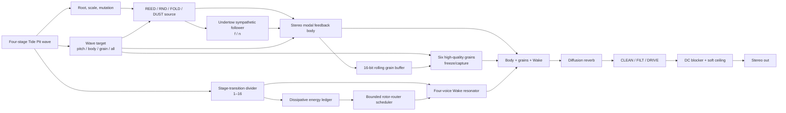

# Cinderwheel (working name): advanced Tide Pit generative resonator

> Status: bounded source/host/JUCE prototype validated; real-time, device, and listening evidence deferred
> Proposal revision: 0.2
> Original idea: Something kind of like a Behringer Spice synth, but using Mutable Instruments modules, maybe Braids or Plaits, with resonance that creates a generative sound; mapped to a Novation Launch Control 3 MIDI controller; able to move from tribal-y to noisy and grungy.
> Revision input: Treat this as a more advanced Tide Pit, not a separate non-granular instrument. The controller is the regular Novation Launch Control 3 with 16 encoders, not the Launch Control XL 3.
> Implementation target: Tide Pit successor expressed as a Schuss instrument proposal; regular Novation Launch Control 3 performance surface; compute target and backend unresolved
> Decision gate: revision 0.2 was approved for the isolated 2026-08-20 implementation trial; the next gate is comparator/listening and exact Tide Pit lineage, not production integration.

## 1. Product thesis

### One-sentence thesis

**HYPOTHESIS:** A coherent advanced Tide Pit can preserve its four-stage feedback-body, granular memory, freeze, mutation, and CLEAN/FILT/DRIVE identity while promoting its sympathetic undertone into an explicit integer-ratio follower and adding a bounded four-voice resonant wake that produces repeatable counter-rhythms.

### Instrument identity

The live Tide Pit already turns four stage values into a continuously evolving pitch/body/grain gesture, with manual mutation, automatic-mutation memory, REED/RND/FOLD sources, a sympathetic lower string, stereo modal body, six high-quality Clouds grains, freeze, diffusion reverb, and CLEAN/FILT/DRIVE endings. This proposal keeps that as the center rather than replacing it.

Two additions make it more advanced without turning it into a different workstation. `Undertow` exposes an integer `f/n` relationship for the existing sympathetic follower. `Pulse Divide` decides which four-stage transitions excite a new `Wake` resonator. `Ember` then determines whether a resonant hit dies where it landed or passes a lossy energy token to another resonator voice. Tide Pit's existing mutation and grain microvariation may remain stochastic; the new wake scheduler is separately bounded and resettable.

The intended performance arc is:

- **Grounded:** the familiar four-stage Tide Pit gesture, REED or RND body, audible cycle, low grain depth, a stable lower Undertow, and little or no resonant wake.
- **Interlocked:** selected stage transitions excite the wake; the Undertow's pitch ratio and the wake's time division create a second line without replacing the original cycle.
- **Corroded:** FOLD or a proposed DUST source, captured grains, inharmonic structure, denser bounded afterstrikes, resonant filtering, and drive.

`Cinderwheel`, `Undertow`, `Wake`, `Ember`, and `Bloom` are working interface names. The product may ultimately be named as a Tide Pit successor; no name is approved here.

### Intended user and musical situation

This is for a performer who likes Tide Pit's slow four-stage evolution and grain capture but wants a clearer secondary rhythm or melody inside the resonance. It should still work as a foreground voice, low-frequency rhythmic bed, or destabilizing layer beside drums. The primary gesture remains shaping the four-stage wave and deciding what it animates; the new ratio and wake controls deepen that gesture instead of replacing it with sequencer programming.

The user's word “tribal-y” is treated as a request for **grounded, bodily, interlocking, percussive motion**, not as a genre label or cultural identity. Section 6 defines the boundary.

### In scope

- Read-only anatomy of the current Tide Pit implementation and the exact behavior to preserve in a successor.
- Selective translation of SPICE/Subharmonicon pitch/time division into Tide Pit's existing four-stage cycle.
- A source-neutral wake architecture using Mutable-informed excitation/resonance principles without requiring a full Plaits provider.
- A complete, one-mode mapping for the regular Novation Launch Control **3**.
- Bounded deterministic generative behavior, parameter ranges, reset semantics, and failure behavior.
- Cultural-context research for the requested interlocking rhythmic feel.
- A computer-science transfer hypothesis and a falsifiable minimal experiment.
- Current Schuss, source, license, build, target, real-time, device, and listening proof gaps.

### Out of scope

- Editing Task 033/034 catalog, semantic, provider, compiler, or runtime records.
- Copying Plaits, Braids, Rings, Grids, or VCV Rack source into Schuss.
- Choosing a Ksoloti, H7, desktop, plugin, or hardware product target.
- Installing software, using the MIDI controller, building firmware, flashing hardware, or making an audible-quality claim.
- Reproducing a named cultural rhythm, repertoire item, sample, instrument, visual identity, or claim of authenticity.
- Removing or demoting Tide Pit's granular buffer, six-grain layer, freeze gesture, diffusion tail, or CLEAN/FILT/DRIVE language.
- Modifying the live `/Users/lanceship/Projects/gills-instruments/projects/tide-pit-gills/` project. A substantially different implementation would begin as a sibling unless separately authorized.

## 2. Inputs, constraints, and decision rights

### Inputs and assumptions

- **EVIDENCE:** The named Behringer reference is [SPICE](https://www.behringer.com/en/products/0718-ACD), whose published surface combines two oscillators, four sub-oscillators, two four-step sequencers, four polyrhythm generators, a multimode filter, and semi-modular patching.
- **EVIDENCE:** The regular [Launch Control 3](https://novationmusic.com/products/launch-control) has 16 endless encoders in two rows of eight, eight assignable buttons, an OLED, USB and three DIN ports, and seven editable Custom Modes plus one default mode. It has no faders.
- **EVIDENCE:** The live Tide Pit README and sources were inspected read-only on 2026-08-20 at `/Users/lanceship/Projects/gills-instruments/projects/tide-pit-gills/`. That checkout is dirty with unrelated user work and was not modified.
- **EVIDENCE:** The current Schuss desktop runtime is a bounded acyclic fixed-point graph host, not proof of Task 030 Mutable-provider execution or an integrated sequencer/resonator instrument; see [STATUS](../../docs/STATUS.md) and the [Task 032 contract](../../docs/tasks/032-variable-graph-desktop-host-runtime.md).
- **INFERENCE:** A desktop-first, source-neutral prototype is the least misleading first proof. A VCV patch is useful for palette audition, but it cannot establish Schuss, embedded, or product feasibility.
- **UNRESOLVED:** The final compute target, backend, polyphony budget, plugin format, controller transport, and distribution license.

### Deliverables

This revision delivers one research proposal containing:

1. cited reference, adjacent-product, engineering, cultural, and computer-science research;
2. the Cinderwheel signal, timing, state, and safety model;
3. an exact controller map and takeover rules;
4. a target/license/resource assessment with explicit proof gaps; and
5. a minimal vertical-slice experiment and evidence ladder.

No DSP deliverable is authorized by this revision alone.

### Acceptance tests for this proposal

- Every requested characteristic has a concrete architectural home.
- Every physical control in one 16-encoder/eight-button Custom Mode has one stable assignment.
- Generated events have stated upper bounds, reset behavior, and panic behavior.
- Reference facts, design inferences, hypotheses, and unresolved claims remain distinguishable.
- The cultural translation defines both a musically testable criterion and a non-borrowing boundary.
- Mutable source/license facts do not become build, target, real-time, or audible claims.
- The next decision authorizes a named experiment rather than open-ended product implementation.

### Decisions this work may make

- The musical identity, public macro names, signal flow, control layout, state model, proposed parameter ranges, and experimental stop conditions.
- That the first implementation, if approved, is source-neutral and offline-capable.
- That the generative system is a bounded event scheduler, never uncontrolled audio feedback.

### Decisions this work must not make

- Task 033 provider architecture, Task 034 semantic records, Schuss compiler support, or a stable object identity.
- Whether Mutable or VCV code is acceptable for a future distributed binary.
- Embedded capacity, hardware compatibility, real-time safety, physical MIDI behavior, or sound quality before the corresponding evidence exists.
- Cultural naming, marketing, or pattern borrowing beyond the limits in Section 6.

## 3. Reference anatomy

This table records published behavior, not inferred proprietary implementation.

| Function | Observable behavior | Evidence | Keep, transform, or reject | Confidence |
|---|---|---|---|---|
| Existing Tide Pit identity | Four stage values drive a continuous evolving gesture; source modes are REED/RND/FOLD; the body includes a sympathetic lower string and stereo modes; six grains, freeze, diffusion reverb, and CLEAN/FILT/DRIVE follow. | Live local README and DSP headers, inspected 2026-08-20 | **Keep as the successor's baseline.** New work must remain recognizably Tide Pit when Undertow and Wake are at minimum. | High |
| Divided voice body | SPICE publishes two VCOs, each with two subharmonic oscillators, mixed as six sources. | [Behringer SPICE](https://www.behringer.com/en/products/0718-ACD) | **Transform:** do not graft six new oscillators onto Tide Pit. Promote its existing sympathetic string into one explicit `f/n` Undertow follower. | High |
| Integer undertones | Subharmonicon documents sub-oscillator frequencies as integer divisions of a parent and offers the first 16 undertones. | [Moog Subharmonicon](https://www.moogmusic.com/synthesizers/subharmonicon/) | **Keep** divisors 1–16 as the pitch relationship, not a cloned circuit or panel. | High |
| Four-stage horizon | SPICE/Subharmonicon use short four-step lanes; Tide Pit already has a four-stage smoothly interpolated wave. | Product sources plus live Tide Pit source | **Keep Tide Pit's continuous four-stage wave.** Do not add a second step-sequencer UI. | High |
| Divided rhythms | Four Subharmonicon rhythm generators divide a master tempo and route to sequencers. | [Subharmonicon](https://www.moogmusic.com/synthesizers/subharmonicon/) | **Transform:** one explicit `Pulse Divide` counts Tide Pit stage transitions and selects which ones excite Wake. | High |
| Subtractive ending | Tide Pit already supplies CLEAN, resonant FILT, and asymmetric DRIVE after its reverb. | Live local README and `tidepit_dsp.h` | **Keep** the three endings and their two remembered contextual controls. | High |
| Macro excitation | Plaits exposes model selection plus Harmonics, Timbre, and Morph; a trigger can drive its internal envelope/LPG and model changes are sampled on trigger. | [Plaits manual](https://pichenettes.github.io/mutable-instruments-documentation/modules/plaits/manual/) | **Defer:** audition Plaits only as a possible fourth source or wake exciter after the successor mechanism passes. Do not add a model browser. | High |
| Grit-capable source | Tide Pit already uses Braids-derived waveguide resources and sine-fold behavior; Braids documents a broad model set and degradation controls. | Live Tide Pit attribution and [Braids manual](https://pichenettes.github.io/mutable-instruments-documentation/modules/braids/manual) | **Keep** REED/RND/FOLD and propose one source-neutral DUST extension; do not require full Braids. | High |
| Resonant body | Rings documents modal, sympathetic-string, and dispersive resonators with Structure, Brightness, Damping, and Position controls and multiple voice modes. | [Rings manual](https://pichenettes.github.io/mutable-instruments-documentation/modules/rings/manual/) | **Keep** the excitation/resonance interaction and macro vocabulary; separate audio resonance from the safe event-energy ledger. | High |
| Repeatable generativity | Marbles' Deja Vu moves between fresh and repeated random material; Tide Pit already has Memory, manual Mutate, and Lock. | [Marbles documentation](https://pichenettes.github.io/mutable-instruments-documentation/modules/marbles/) plus live Tide Pit source | **Keep Tide Pit's existing evolution contract.** Make only the added wake scheduler deterministic/resettable. | High |
| Morphable rhythm map | Grids interpolates through a two-dimensional map of three-channel drum patterns and varies density. | [Grids manual](https://pichenettes.github.io/mutable-instruments-documentation/modules/grids/manual/) | **Reject for v0:** it would import a second generative identity and obscure the divider/rotor experiment. | High |

## 4. Adjacent landscape

| Product or project | Type | Relevant mechanism | Distinguishing behavior | Source | Design implication |
|---|---|---|---|---|---|
| Tide Pit | Existing Ksoloti/Gills instrument | Four-stage evolving waveguide/body, sympathetic string, six Clouds grains, freeze, mutation memory, diffusion reverb, CLEAN/FILT/DRIVE | Its gesture, feedback body, and grain memory are already one coherent instrument | Live read-only files at `/Users/lanceship/Projects/gills-instruments/projects/tide-pit-gills/` | Treat it as the baseline and create a successor/sibling rather than replacing it in place. |
| Behringer SPICE | Analog semi-modular hardware | Six divided tone sources, dual four-step sequencing, four rhythm divisions | Polyrhythm and subharmonic pitch are equally prominent | [Official product page](https://www.behringer.com/en/products/0718-ACD) | Preserve the small legible rhythmic machine, not its panel or circuitry. |
| Moog Subharmonicon | Analog semi-modular hardware | `f/n` undertones and routeable divided clocks | Integer pitch and time relationships share one conceptual language | [Official product page](https://www.moogmusic.com/synthesizers/subharmonicon/) | Cinderwheel should make ratios playable without mathematical setup. |
| Mutable Instruments Plaits/Braids | Open-source digital modules | Broad macro-oscillator and percussive/noise palettes | A few continuous controls span large timbral distances | [Plaits](https://pichenettes.github.io/mutable-instruments-documentation/modules/plaits/manual/), [Braids](https://pichenettes.github.io/mutable-instruments-documentation/modules/braids/manual) | Curate four excitation zones so range does not become loss of identity. |
| Mutable Instruments Rings | Open-source digital module | Exciter/resonator separation and polyphonic modal/string models | The input event becomes a material-like ringing body | [Rings manual](https://pichenettes.github.io/mutable-instruments-documentation/modules/rings/manual/) | Make resonance the compositional agent, but do not feed raw audio back without bounds. |
| Mutable Instruments Marbles | Open-source digital module | Probability, looping, and controlled repetition | Randomness can become an intentional, recoverable phrase | [Marbles documentation](https://pichenettes.github.io/mutable-instruments-documentation/modules/marbles/) | Provide deterministic reset and mutation before adding probability. |
| Audible Instruments for VCV Rack | Authorized software ports | Macro Oscillator 2, Resonator, and other Mutable-derived modules | Fast palette audition with VCV MIDI mapping | [VCV Audible Instruments](https://vcvrack.com/AudibleInstruments), [VCV MIDI-Map](https://vcvrack.com/manual/Core) | Useful for listening research only; its GPL plugin and host behavior do not prove a Schuss/provider target. |
| Earlier Cinderwheel revision 0.1 | Superseded proposal | Separate six-tone body, two lanes, and non-granular resonant identity | It incorporated SPICE literally but did not preserve Tide Pit's center | This file's prior revision and user correction, 2026-08-20 | Reject the separate instrument architecture; retain only ratio, bounded-wake, evidence, and ethical findings. |

**UNRESOLVED:** This was a focused landscape, not an exhaustive VST/AU, patent, or academic product search. No dedicated commercial plugin with the exact divided-body plus resonator-energy routing combination was established. That absence is not a novelty claim.

## 5. Synthesis and engineering research

| Paper, standard, or technical source | Mechanism | Evidence strength | Applicability | Limitation |
|---|---|---|---|---|
| Karplus and Strong, “Digital Synthesis of Plucked-String and Drum Timbres” (1983) | A short recirculating delay with filtering produces efficient decaying pitched or drum-like sound. | Peer-reviewed historical paper: [PDF](https://www.moforte.com/wp-content/uploads/2020/05/Karplus-Strong-CMJ-1983.pdf) | Supports the feasibility of an efficient resonant prototype and explicit loss per circulation. | Does not specify Cinderwheel's modal bank, generative scheduler, anti-aliasing, or target budget. |
| Mutable Rings documentation | Multiple resonator families and macro controls over modal structure, brightness, damping, and excitation position. | First-party functional documentation: [manual](https://pichenettes.github.io/mutable-instruments-documentation/modules/rings/manual/) | Grounds the proposed exciter/resonator control language and four-voice test. | Documentation is not permission to claim Rings compatibility or a Schuss build. |
| Mutable eurorack repository | Firmware source is MIT-licensed; hardware files have a different CC license; Mutable names and marks are not a derivative-product identity. | First-party repository: [GitHub](https://github.com/pichenettes/eurorack) | A later source audit can distinguish DSP source, wrapper, hardware, and naming obligations. | Repository license facts do not settle Schuss distribution, wrapper, patent, or combined-work questions. |
| Novation Launch Control 3 documentation | The regular model has 16 endless encoders, eight assignable buttons, an OLED, seven editable Custom Modes, and USB/DIN routing. Custom controls may send CC, notes, program changes, NRPN, or keystrokes. | First-party [specifications](https://userguides.novationmusic.com/hc/en-gb/articles/30683924222098-Launch-Control-3-s-Specifications), [Custom Modes](https://userguides.novationmusic.com/hc/en-gb/articles/30683913741202-Using-Custom-Modes-on-the-Launch-Control-3), and [standalone guide](https://userguides.novationmusic.com/hc/en-gb/articles/30683913767954-Using-Launch-Control-3-outside-of-a-DAW) | Supports one named Custom Mode with 16 CC encoders and eight momentary CC buttons. | Physical receipt, exact Components export format, state feedback, DIN routing, and firmware-version behavior have not been tested. |
| JUCE MIDI/audio callback documentation | MIDI can be collected into timestamped audio blocks; the audio callback is a high-priority real-time path. | First-party API docs: [MidiMessageCollector](https://docs.juce.com/master/classjuce_1_1MidiMessageCollector.html), [AudioIODeviceCallback](https://docs.juce.com/master/classjuce_1_1AudioIODeviceCallback.html) | Consistent with timestamped control application and avoiding allocation, locks, UI calls, and blocking in the callback. | The first source-neutral offline slice does not need JUCE; documentation is not a latency measurement. |
| Current Schuss MIDI ingress | One physical MIDI input feeds a bounded SPSC queue with timestamps, sequence numbers, three-byte messages, and overflow accounting. | Local source: [midi_ingress.hpp](../../apps/schuss_audio_engine/src/midi_ingress.hpp) | A future host integration has a bounded ingress pattern to preserve. | No physical Launch Control 3 evidence and no successor integration exist. |

**DESIGN INFERENCE:** The successor should preserve Tide Pit's audible feedback-body and grains, but must not derive new generative events from saturated output or the grain/reverb return. A separate dissipative scalar energy ledger schedules Wake afterstrikes. This keeps the new work bounded without sanitizing Tide Pit's sound.

## 6. Musical-practice research

| Named practice, community, place, and period | Source and source relationship | Structural principle | Possible translation | Context or restriction | Risk |
|---|---|---|---|---|---|
| Anlo-Ewe dance-drumming, southern Ghana, living practice | C.K. Ladzekpo is an Anlo-Ewe master drummer and teacher; his [Foundation Course](https://ladzekpo.com/FoundationContents.html) and [rhythmic texture discussion](https://ladzekpo.com/Textures.html) describe a main beat as the focal reference for cross-rhythmic parts. | Independent parts remain intelligible in relation to a shared main beat; cross-rhythm is relational, not free timing drift. | Tide Pit's four-stage cycle remains the audible anchor; Undertow and Wake relate to its stage transitions and cannot silently erase it. | The practice joins music, dance, community, language, social roles, and embodied teaching. A controller algorithm loses that context. | Turning a living practice into an exotic mood, preset label, or decontextualized pattern. |
| Agbadza, Ewe communities, Ghana/Togo, living and historically documented practice | Ethnomusicologist David Locke's [critical edition](https://sites.tufts.edu/davidlocke/files/2012/01/Agbadza-Critical-Edition-final-DL1.pdf) studies ensemble relationships, pulse, timeline, and performance interpretation. | A repeating orienting structure supports multiple valid heard relationships rather than forcing one line to “own” the meter. | Test whether a performer can hear one stable cycle while shifting attention between body, primary strikes, and afterstrikes. | Notation is an analytical lens, not a substitute for participation, dance, language, or community authority. | Copying a bell timeline would convert scholarship into uncredited repertoire extraction. |
| Gahu, southern Ewe-speaking communities, contemporary social performance | Scholarly contextual account in the [IAWM Journal](https://journal.iftawm.org/previous/2023-volume-11-no-2/johnston/) situates drumming, lead-drum cues, dance, and social occasion together. | Musical layers participate in social and bodily coordination, not just abstract ratio play. | Keep controls immediate, resettable, and performable with the body; evaluate gesture and orientation, not only algorithmic complexity. | This proposal does not recreate Gahu, its cues, timeline, instruments, dance, names, or social meanings. | Marketing an abstract machine as culturally authentic or “tribal.” |

### Ethical and design boundary

- The public design vocabulary is `grounded`, `interlocking`, `bodily`, `percussive`, `noisy`, and `corroded`; “tribal” is not a product category or preset name.
- No Ewe/Anlo-Ewe bell pattern, sample, instrument imitation, name, visual motif, repertoire fragment, sacred/private material, or authenticity claim enters the implementation.
- The borrowed **structural test**, not content, is: a stable focal pulse must remain recoverable while several parts create tension against it.
- If a future product wants cultural naming, recognizable rhythmic content, or a claimed lineage, that becomes a separate collaboration requiring practitioner review, credit, consent, and compensation.

## 7. Computer-science transfer search

| Concept and home field | Existing audio prior art found | Proposed mapping | Musical benefit | Failure mode | Falsifying experiment |
|---|---|---|---|---|---|
| Rotor-router walk; deterministic processes on graphs | A focused search on 2026-08-20 for `rotor-router music sequencer`, `rotor-router audio synthesis`, and related chip-firing terms found graph-theory sources but no exact audio application. This is a bounded search result, not proof of absence. The core mechanism is documented by Cooper et al., [“Deterministic Random Walks on the Integers”](https://arxiv.org/abs/math/0602300). | Four resonator voices are graph nodes. When a node spends an energy token, its rotor chooses clockwise, opposite, then counter-clockwise neighbors in a fixed cycle; the rotor advances and transfers only a lossy fraction. | It distributes afterstrikes with random-walk-like variety while remaining exactly resettable and rehearsable. | It may sound like a plain multi-tap delay, become too periodic, or hide the main pulse. | Compare identical gestures with `Ember=0`, rotor transfer, and a simple fixed round-robin echo. If listeners cannot distinguish the rotor condition or prefer it only near instability, reject it. |
| Chip-firing/sandpile dynamics; distributed graph systems | General mathematical prior art was found, but no source was accepted here as audio prior art. | Accumulated node energy could trigger cascades when thresholds are crossed. | Potentially rich density transitions. | Avalanches make worst-case event count and musical causality harder to bound. | **Rejected for v0:** implement only deferred, capped transfer; do not prototype simultaneous cascades. |
| Ordinary pseudo-random walk; stochastic processes | Randomized generative sequencing is common in musical tools, including Marbles-like controlled randomness. | Randomly choose the next resonator voice. | Immediate variation. | Seed/state can still be reproducible, but the behavior is harder to learn by gesture and adds no useful constraint to the first hypothesis. | **Rejected for v0:** rotor routing must beat a fixed echo before probability is considered. |

**PROPOSED CONTRIBUTION, BOUNDED:** The research-supported design claim is not “a novel algorithm.” It is a proposed musical transfer: use a lossy rotor-router as the scheduler for a resonator's modelled energy, then protect a separate shared pulse so the secondary rhythm can become complex without becoming unbounded or unrecoverable.

## 8. Novelty map

### Common elements

- Four-stage or four-step cyclic control.
- Integer-divided pitch and event timing.
- Macro-source timbre control.
- Exciter/resonator synthesis.
- Granular capture/freeze, diffusion reverb, resonant filtering, and drive.
- Random, memory-weighted, or locked generative mutation.

### Less-common combinations found

- SPICE/Subharmonicon place integer pitch division and integer time division on the same small performance surface.
- Rings treats an excitation as material-dependent resonant behavior rather than as a conventional sustained oscillator.
- Marbles makes repetition versus renewal a performance parameter rather than an implementation detail.
- Tide Pit already combines a feedback waveguide, sympathetic follower, stereo modal body, six-grain buffer, bounded mutation, and mode-specific soft pickup in one continuous gesture.

### Proposed contribution

**HYPOTHESIS:** The distinctive combination is Tide Pit's preserved four-stage feedback/granular body, an explicitly playable `f/n` Undertow, a stage-transition divider, and a four-node Wake whose **modelled, dissipating energy** routes deterministic afterstrikes. One 16-encoder/eight-button Custom Mode exposes the whole performance layer.

The search was targeted, not exhaustive. Patent coverage, commercial plugin coverage, and independent implementations remain unresolved. “Distinctive proposal” is the strongest justified phrase; “new,” “first,” and “unique” are not justified.

### Rejected directions

| Direction | Reason rejected | Evidence or risk |
|---|---|---|
| Separate six-tone body and dual four-step sequencers from revision 0.1 | It follows SPICE too literally and replaces Tide Pit instead of advancing it. | User correction; duplicated cyclic systems and too many controls for the regular Launch Control 3. |
| Raw resonator-output feedback drives its own trigger detector | Unbounded or aliasing-prone behavior would conflate a desired dirty sound with unsafe event generation. | Event rate, phase, and reset would depend on signal peaks and numeric details. |
| All Plaits/Braids models on one control | It creates browsing, discontinuities, and weak instrument identity. | Tide Pit already has three recognizable sources; one DUST extension is enough to test. |
| Removing the Clouds-derived grain/freeze layer | It would erase the actual Tide Pit lineage the user clarified. | Live Tide Pit anatomy and user correction. |
| Recording Wake output back into the grain buffer | It creates a hidden feedback route in which resonance can alter later excitation density. | Harder gain, causality, and reset analysis; defer unless independently bounded. |
| Imported Ewe timeline or “tribal” preset | It is unnecessary for the structural goal and creates an extractive authenticity claim. | Section 6. |
| Replacing Tide Pit mutation with rotor determinism | The existing Memory/Mutate/Lock behavior is part of the instrument. | Keep stochastic grain/mutation behavior separate from the deterministic Wake scheduler. |
| Launch Control XL 3 mapping | It assumes 24 encoders, eight faders, and 16 buttons that the user's controller does not have. | [Regular Launch Control 3 specifications](https://userguides.novationmusic.com/hc/en-gb/articles/30683924222098-Launch-Control-3-s-Specifications). |
| Full Task 030 provider integration now | Current workspace work separates provider audit, semantic acceptance, and runtime support. | [Task 033](../../docs/tasks/033-object-collections-and-native-provider-architecture.md) and [STATUS](../../docs/STATUS.md). |
| Embedded-first proof | Source candidates and resource classes are catalog facts, not a successful target build or deadline measurement. | [Task 030 review](../../catalog/reviews/task030-mutable-catalog-v1/entries.jsonl). |

## 9. Recommended architecture

### Signal flow

#### Preserved Tide Pit core

- The four stage values remain a smooth cyclic wave, not four independent note steps. The proposed rate remains the live Tide Pit range of approximately 0.08–6 cycles per second.
- Root, one of four scales, bounded per-stage mutation, Memory, manual Mutate, Lock, and the PITCH/BODY/GRAIN/ALL modulation target remain part of the identity.
- REED, RND, and FOLD preserve their present roles. A proposed fourth `DUST` source is filtered or clocked noise with a clear transient; it is source-neutral in the first experiment. A later audition may test one exact Plaits or Braids-derived candidate without making the whole module a dependency.
- The stereo modal body records into a 16-bit rolling buffer that feeds six high-quality grains. Freeze/capture, diffusion reverb, and CLEAN/FILT/DRIVE remain downstream.
- Wake output does **not** write back into the grain buffer in revision 0.2. Grains may color Wake through the shared reverb/effects, but cannot generate more Wake events.

#### Undertow and Pulse Divide

- `Undertow` promotes Tide Pit's existing sympathetic lower string into an explicit follower at `f / n`, where `n` is Off or an integer 1–16. Divisor 1 is unison; 2 is the octave below. The follower remains excited by the main source rather than becoming a second free-running oscillator bank.
- `Pulse Divide` counts the existing four-stage transitions. At `n=1`, every transition gives Wake a primary excitation; at `n=16`, every sixteenth transition does. Changing the divisor applies at the next transition without resetting the four-stage phase.
- This is the selective SPICE/Subharmonicon transfer: pitch division and time division become two adjacent performance controls, but Tide Pit keeps one four-stage gesture rather than acquiring two new sequencers and six mixer voices.

#### Wake resonator and energy ledger

- Four Wake voices are allocated round-robin on accepted Pulse Divide events. The initial experiment uses an original small modal bank; it does not require Rings source.
- Each accepted transition gives the allocated voice an excitation derived from the main body transient and deposits normalized energy in the matching ledger node. The ledger value is a control-state estimate, not measured audio amplitude.
- On each later stage transition, energy decays. Eligible nodes may spend one threshold unit, create an attenuated afterstrike, and transfer at most `0.72` of that unit to a neighbor selected by its rotor. Newly transferred energy cannot fire during the same transition.
- Each node has a one-transition refractory period. The scheduler emits at most one afterstrike per node and at most two afterstrikes globally per stage transition.
- Rotor neighbor order is clockwise, opposite, counter-clockwise. Short Reset restores all rotor positions, allocation position, pending energy, cycle phase, and bounded mutation offsets; it preserves current encoder values and the captured grain buffer.
- `Ember=0` makes coupling zero and creates exactly zero afterstrikes while ordinary Wake resonance can still ring from primary excitations. Across the upper range it lowers the spend threshold, lengthens Wake decay, and raises transfer toward the `0.72` cap.
- `Wake=0` ramps the new resonator to bypass and clears its pending ledger after 10 ms, so hidden energy cannot erupt when the control is raised later.
- `Bloom` is momentary: it lowers the spend threshold and adds one bounded primary token at the next transition, without changing the event caps or coupling ceiling.
- The energy ledger never receives grain, reverb, filter, drive, or output samples. Dirt does not create unbounded scheduling work.

The decay curve, threshold floor, DUST source, and afterstrike amplitude are **HYPOTHESIS** details until the minimal listening experiment. Event caps, no-same-transition recursion, and zero behaviors are contract candidates.

#### Output

- Body and grains preserve the current center. `Wake` is an additive resonant return with automatic gain compensation, not a wet/dry replacement for Tide Pit.
- Wake voices alternate across stereo before the common diffusion tail. The existing grain spread remains independent.
- CLEAN, FILT, and DRIVE keep two remembered contextual values. A successor should retain soft pickup or state-safe encoder behavior when switching modes.
- A DC blocker and soft ceiling target −1 dBFS. A long Panic clears active resonators, grain voices/buffer capture, envelopes, and ledger state through a 10 ms ramp; it does not alter saved parameter values.

### State and timing model

The authoritative state is finite and serializable:

- four-stage phase and values, rate, Memory, bounded mutation offsets, Lock, root, scale, and Wave Target;
- source mode, body material, grain position, captured/freeze state, and six-grain scheduler state;
- CLEAN/FILT/DRIVE mode plus two remembered values per mode;
- Undertow ratio, Pulse Divide counter, Wake level, Structure, and Ember;
- four Wake allocations, energy scalars, refractory flags, and rotor indices;
- Bloom, Reset/Panic gesture timers, output ramp, and diagnostic counters.

Control events are ordered by `(sample timestamp, ingress sequence)`. Continuous controls ramp over 20 ms by default. Root, Undertow ratio, Pulse Divide, source, scale, effect mode, and Wave Target apply at the next stage transition or through an explicit short crossfade. Processing must be invariant to host block partitioning for the same timestamped event stream.

Tide Pit's existing mutation and grain scheduling may use seeded pseudo-random state. Reset must restore the Wake ledger and musical cycle exactly, but full sample-for-sample audio repeatability is claimed only if the prototype also snapshots and restores every Tide Pit/grain random state. `Freeze` controls the rolling grain buffer. `Bloom` affects Wake only. Reset is musical state reset; Panic is the stronger safety operation and works in every state.

### Control and performance mapping

The primary contract uses one editable Custom Mode named `TIDE PIT+` on MIDI channel 16. Novation Components is required to install this mapping on the controller; that controller mutation has **not** been performed or authorized. For the proposal, encoders use CC20–35 and the eight assignable buttons use momentary CC40–47. USB is the first host-test transport; DIN 1 is a later target option. The seven other/default mode slots are not part of performance.

Novation documents 16 endless encoders in two rows of eight and eight assignable buttons. Page, Track, Shift, Mode, and Function retain controller/system behavior and are not instrument controls in standalone Custom Mode. The design therefore has one performance page and no faders.

#### Encoders

| Physical control | MIDI | Assignment | Range/states | Application rule |
|---|---:|---|---|---|
| Top 1 | CC20 | Wave 1 | 0–1 stage height | 20 ms ramp; preserves manual priority over mutation |
| Top 2 | CC21 | Wave 2 | 0–1 stage height | Same |
| Top 3 | CC22 | Wave 3 | 0–1 stage height | Same |
| Top 4 | CC23 | Wave 4 | 0–1 stage height | Same |
| Top 5 | CC24 | Rate | Approx. 0.08–6 cycles/s | Phase-continuous slew; no reset |
| Top 6 | CC25 | Memory | 0 = evolves often; 1 = strongly repeats | 20 ms ramp; Lock still overrides auto mutation |
| Top 7 | CC26 | Body | 0–1 material/damping macro | 20 ms stable coefficient interpolation |
| Top 8 | CC27 | Position | 0–1 rolling-buffer read position | 20 ms ramp |
| Bottom 1 | CC28 | FX A | CLEAN grain size; FILT cutoff; DRIVE tone | Per-mode remembered value; soft takeover after mode switch |
| Bottom 2 | CC29 | FX B | CLEAN grain depth; FILT resonance; DRIVE amount | Per-mode remembered value; soft takeover after mode switch |
| Bottom 3 | CC30 | Root | MIDI 36–72 | Apply/glide at next stage transition |
| Bottom 4 | CC31 | Undertow | Off, then integer `f/n` 1–16 | Detented; apply next transition without source reset |
| Bottom 5 | CC32 | Pulse Divide | Integer 1–16 stage transitions | Detented; apply next transition; phase preserved |
| Bottom 6 | CC33 | Wake | 0–1 additive resonant return | 20 ms ramp; exact zero clears pending Wake energy |
| Bottom 7 | CC34 | Structure | 0–1 modal ratio/brightness/spread macro | 20 ms stable coefficient interpolation |
| Bottom 8 | CC35 | Ember | 0–1 Wake decay/coupling macro | 20 ms ramp; `0` means exactly zero afterstrikes |

Components should give these short OLED labels: `WAVE1`, `WAVE2`, `WAVE3`, `WAVE4`, `RATE`, `MEMORY`, `BODY`, `POSITION`, `FX-A`, `FX-B`, `ROOT`, `UNDERTOW`, `PULSE DIV`, `WAKE`, `STRUCTURE`, and `EMBER`.

**UNRESOLVED:** The first simulator treats encoder CCs as absolute. Custom-Mode relative output, value feedback after host-state recall, RGB semantics, and exact OLED behavior require the physical controller and current Components version. Until then, recalled state must use host-side soft takeover rather than assuming the endless encoders are synchronized.

#### Buttons

| Physical control | MIDI | Assignment | Behavior |
|---|---:|---|---|
| Button 1 | CC40 | Source / Scale | Tap cycles REED → RND → FOLD → DUST; hold 600 ms cycles scale without advancing source |
| Button 2 | CC41 | Mutate | Momentary; one bounded mutation on press |
| Button 3 | CC42 | Lock | Tap toggles automatic evolution lock |
| Button 4 | CC43 | Freeze | Tap toggles grain-buffer capture/freeze |
| Button 5 | CC44 | FX Mode | Tap cycles CLEAN → FILT → DRIVE with crossfade and remembered FX-A/B |
| Button 6 | CC45 | Wave Target | Tap cycles PITCH → BODY → GRAIN → ALL |
| Button 7 | CC46 | Bloom | Momentary; next transition lowers Wake threshold/adds one bounded token; caps unchanged |
| Button 8 | CC47 | Reset / Panic | Tap resets cycle/mutation/Wake but preserves captured buffer; hold 1200 ms performs click-safe Panic |

All eight buttons are configured as momentary CCs; the instrument owns tap/hold/toggle state. This prevents controller-local toggle state from silently disagreeing with recalled instrument state. Multi-state Source, Scale, FX, Target, Lock, and Freeze feedback must appear on the eventual Schuss or Gills display. The Launch Control OLED's local labels/value preview are useful but are not accepted as proof of application-state feedback.

### Parameter interactions and edge cases

- Undertow Off removes the sympathetic follower from the successor mix; changing its ratio never phase-resets the main source.
- Pulse Divide changes only which stage transitions excite Wake. It does not change Tide Pit's cycle speed or stage interpolation.
- Wake zero is a structural bypass/clear. Ember zero is an afterstrike bypass, not merely a very low probability; primary Wake strikes may still ring when Wake is above zero.
- Bloom at maximum Ember cannot exceed two global afterstrikes per transition.
- Freeze stops rolling-buffer capture but does not freeze the four-stage cycle, Undertow, Wake, or diffusion tail.
- Switching effect mode never changes the remembered CLEAN grain controls. FX-A/B wait for soft takeover before replacing a recalled mode value.
- Source, Scale, Target, and FX changes crossfade or latch at a transition; they cannot switch a DSP topology mid-sample.
- Reset preserves control positions and a captured grain buffer; Panic releases capture and clears active audio/state after its ramp.
- Grain randomness, filter resonance, drive, and reverb never feed the Wake ledger, so dirt cannot create more scheduled computation.
- Unknown MIDI, running-status reconstruction errors, SysEx, and other channels are ignored and counted; they do not mutate instrument state.

### Failure behavior

- Non-finite DSP state clears the affected resonator voice, increments a diagnostic counter, and continues through the output ramp; it must not propagate NaN/Inf.
- MIDI queue overflow retains the existing Schuss-style counter and drops bounded input rather than allocating or blocking.
- Event-cap saturation increments a counter. Deferred energy remains subject to decay; it is not released as an uncapped burst later.
- Invalid saved state fails closed instead of partially restoring incompatible ranges.
- Loss of controller connection leaves the last safe state sounding; Panic remains available from the host/Gills surface. Automatic reconnection and encoder resynchronization remain unresolved.
- If Undertow or Wake allocation fails on an eventual embedded target, the successor must expose a diagnostic and fall back to the preserved Tide Pit path rather than emitting partial unstable state.

## 10. Target and resource feasibility

| Constraint | Assumption or measured value | Evidence | Budget or limit | Status |
|---|---|---|---|---|
| First experiment sample rate | 48 kHz | Chosen to match current Schuss runtime contract | Fixed for v0 render | **PROPOSED** |
| Block size | Must preserve output/event behavior across 64, 128, and 512 frames | Current Task 032 supports variable blocks up to 512 | No block-dependent state transitions | **PROPOSED** |
| Event rate | Live Tide Pit's proposed maximum is about six cycles/s, or 24 stage transitions/s; Wake allows at most one primary and two afterstrikes per transition | Architecture above | 72 Wake strikes/s maximum, independent of grains/reverb | **INFERENCE**, test required |
| Resonator voice count | Four fixed voices | Product architecture | No dynamic allocation or audio-thread memory allocation | **PROPOSED** |
| Existing Tide Pit cost | The live source allocates waveguide, sympathetic string, grain-buffer storage, six grains, stereo modes, and diffusion reverb; its README warns that it is heavier than Tidepool | Read-only local source/README | No current CPU, memory, deadline, or connected-board measurement was run in this revision | **EVIDENCE with resource gap** |
| Numeric format | Source-neutral prototype uses `float`; current Schuss runtime factories use Q27 | [STATUS](../../docs/STATUS.md), [Task 032](../../docs/tasks/032-variable-graph-desktop-host-runtime.md) | No conversion claim until integration is designed | **UNRESOLVED** |
| MIDI latency | Timestamped messages should apply sample-accurately within the received block | JUCE docs and local MIDI ingress | Measure callback-to-event timing; no claimed number | **UNRESOLVED** |
| Desktop CPU | No measurement exists for the preserved Tide Pit-shaped core plus Undertow/Wake/scheduler | None | Report median, p99, and worst callback time before setting a budget | **UNRESOLVED** |
| Embedded CPU/RAM | The current Tide Pit source exists for Ksoloti/Gills, but this turn did not reproduce a fresh link or deadline; Task 030 catalog entries also do not prove Schuss support | Live source plus [Task 030 review](../../catalog/reviews/task030-mutable-catalog-v1/entries.jsonl) | No F427/H7/Ksoloti promotion without fresh compile/link, allocation, and worst-case deadline evidence | **UNRESOLVED** |
| Full Plaits candidate | Current source metadata records the full 24-engine candidate as `h7-recommended` and `build-failed`; that is not a product verdict | [Task 030 review](../../catalog/reviews/task030-mutable-catalog-v1/entries.jsonl) | Do not make it a v0 dependency | **EVIDENCE** |
| Rings-like candidate | A physical-resonator candidate is catalogued, with wrapper/DSP license distinctions, but remains outside current runtime support | [Task 030 review](../../catalog/reviews/task030-mutable-catalog-v1/entries.jsonl), [STATUS](../../docs/STATUS.md) | Use an original small modal bank for the experiment | **EVIDENCE** |
| Toolchain | Current desktop host pins JUCE; the experiment can use C++17 and no third-party DSP source | [audio-engine CMake](../../apps/schuss_audio_engine/CMakeLists.txt) | No package install; build outside shared runtime | **PROPOSED** |
| Mutable firmware license | Firmware repository states MIT; hardware and marks are separate concerns | [Mutable eurorack repository](https://github.com/pichenettes/eurorack) | Audit exact files/commit and attribution before copying any source | **EVIDENCE** |
| VCV Audible Instruments license | VCV library lists the plugin as GPL-3.0-or-later | [VCV Library](https://library.vcvrack.com/AudibleInstruments) | Audition only; do not copy into Schuss under this proposal | **EVIDENCE** |
| Schuss/product distribution license | No combined-work conclusion was established | This proposal only | Separate legal/license decision before source integration or distribution | **UNRESOLVED** |
| Controller setup | One Custom Mode must be created with Components; the proposal assigns channel 16, CC20–35, and momentary CC40–47 | [Custom Modes guide](https://userguides.novationmusic.com/hc/en-gb/articles/30683913741202-Using-Custom-Modes-on-the-Launch-Control-3) | No Components write, export, or device configuration occurred | **PROPOSED** |
| Device and audible behavior | No Launch Control 3, Gills board, audio capture, or listening session occurred | This research run | Never infer from source/catalog/host facts | **UNRESOLVED** |

### Target recommendation

1. **First:** an offline-capable, source-neutral C++ Wake/Undertow slice driven by a deterministic four-stage Tide Pit-shaped stimulus. This tests division, timing, bounds, reset, and the rotor hypothesis without copying or modifying the live instrument.
2. **Then, if H1 passes:** compare the new layer against the real Tide Pit signal path in an isolated sibling experiment. Reusing the live MIT project and Mutable-derived dependencies requires an explicit target/scope decision and the Gills instrument workflow.
3. **Optionally:** audition Plaits/Rings colors in a disposable VCV Rack patch if the software is already available or installation is separately authorized; that is palette evidence only.
4. **Later:** decide between desktop Schuss, a plugin, Ksoloti/Gills, or an H7-class target after Task 033/034 boundaries, exact source/license review, compile/link evidence, and measured cost.

This ordering proves the musical mechanism before making a provider architecture or hardware promise.

## 11. Minimal experiment

### Central hypothesis

**HYPOTHESIS H1:** Adding an explicit Undertow ratio and a lossy rotor-routed Wake to Tide Pit's four-stage event structure produces a controllable secondary rhythm/melody that is audibly different from an ordinary resonator tail while preserving the recognizable four-stage granular body.

### Smallest vertical slice

- A deterministic four-stage generator matching Tide Pit's 0.08–6 cycles/s range, stage interpolation, bounded mutation offsets, and transition events. It is a test stimulus, not a reimplementation claim.
- One original body/excitation surrogate and one sympathetic `f/n` delay follower with Off/1–16 Undertow states.
- Pulse Divide 1–16, four small Wake resonators, and the complete bounded energy/rotor state machine with Ember/Bloom/Reset/Panic and event ledger.
- A simple deterministic grain-like stereo bed only for masking/context tests; no Clouds, Braids, Plaits, Rings, or live Tide Pit source in the first slice.
- Simulated channel-16 CC20–35/40–47 input using the exact regular Launch Control 3 map; no GUI, Components write, or physical MIDI required for the first proof.

### Test signals and gestures

Render one fixed 32-cycle gesture at 0.8 cycles/s under five conditions:

1. baseline four-stage body/grain surrogate, Undertow Off, Wake zero;
2. Undertow only at `f/3`, Wake zero;
3. primary Wake strikes with `Ember=0`, so there are no afterstrikes;
4. Pulse Divide 3 with rotor routing at medium Ember;
5. the same rotor condition at high Ember plus a four-cycle Bloom gesture.

Use the same four stage values, mutation trace, source events, grain-like bed, and Structure sweep. Render a second “corroded” gesture that raises source noise, grain density, filter resonance, and drive without changing Pulse Divide or the ledger. Its event ledger must remain identical to the cleaner counterpart.

### Measurements

- Exact event-ledger equality across repeated runs with identical state and gestures.
- Exact event-ledger equality and audio agreement within `1e-6` across block sizes 64, 128, and 512.
- Undertow Off contributes exact zero; each active ratio produces the expected `f/n` within pitch-estimation tolerance.
- Exactly zero afterstrikes at `Ember=0`.
- No more than two afterstrikes per stage transition and no newly transferred token firing during the same transition.
- At the proposed maximum cycle rate, the ledger never exceeds 72 Wake events/s.
- After Reset, the next 16 cycles reproduce the reference event ledger exactly. Full audio equality is required only when every surrogate/random state is included in Reset.
- Panic reaches silence after its 10 ms ramp and leaves zero pending energy.
- No NaN/Inf; normalized output peak at or below the −1 dBFS ceiling; absolute mean below `1e-4` after the DC blocker on the test render.
- Report event-cap hits, MIDI drops, non-finite clears, render duration, and processing time. A timing report is desktop evidence only.

### Listening protocol

- Loudness-match the five H1 conditions after rendering while preserving transient shape.
- Randomize five short pairs: baseline versus Undertow, plain Wake versus rotor Wake, and clean-context versus corroded-context rotor renders.
- Ask four separate questions: “Does this still read as the same four-stage/granular instrument?”, “Can you hear Undertow as a related lower line?”, “Does Wake feel causally connected rather than pasted-on echo?”, and “Can Ember move it from sparse to dense without losing the cycle?”
- H1 passes provisionally only if the user distinguishes rotor Wake from plain Wake in at least four of five relevant trials, rates preservation of the four-stage anchor at least 3/5 at medium and high Ember, and says the Undertow/Wake layer feels like a deeper Tide Pit rather than a separate synth. This is author acceptance evidence, not general listener validation.
- In a later physical-controller session, verify that the grounded and corroded endpoints can be reached without a page change and that Reset/Panic are findable under performance pressure.

### Stop or pivot conditions

Stop or replace the rotor mechanism if any is true:

- it is indistinguishable from a fixed echo/resonator tail in the listening test;
- useful variation occurs only close to cap saturation or loss of the anchor;
- Reset does not make the pattern learnable;
- Ember behaves as a disguised wet/dry or decay knob rather than a secondary-rhythm control;
- Undertow and Wake sound like an unrelated overlay rather than consequences of the four-stage body;
- the 16-encoder/eight-button map cannot cover both familiar Tide Pit gestures and the new layer without mode changes;
- source-neutral resonators already exceed the eventual target's measured budget.

If the mechanism passes but DUST or the exciter palette does not, retain REED/RND/FOLD and the scheduler, then run a separate Plaits/Braids audition. Do not redesign the Tide Pit core and Wake at the same time.

## 12. Acceptance and evidence matrix

| Claim | Acceptance check | Evidence level | Result | Artifact |
|---|---|---|---|---|
| The idea has a coherent instrument identity | Architecture, performance arc, and failure model all support one thesis | Research/design | **PASS for proposal** | This document |
| Reference anatomy is evidence-bounded | Published behaviors cited; proprietary implementation not inferred | Source/reference | **PASS for proposal** | Sections 3–5 |
| The live Tide Pit baseline is understood | README, object interface, and included DSP headers inspected read-only; preserved and changed behaviors listed | Source/reference | **PASS for proposal** | Sections 1, 3, and 9 |
| The controller has a complete stable map | 16 encoders and eight buttons assigned; prototype raw MIDI and gesture semantics validated | Documentation plus simulated host input | **PASS for prototype** | Section 9 and `../prototypes/cinderwheel/fixtures/launch-control-3-test-map-v0.json` |
| Cultural translation is situated and bounded | Practitioner/scholarly context, structural test, and non-borrowing list present | Cultural research | **PASS for proposal** | Section 6 |
| Rotor transfer is universally novel | Exhaustive prior-art search | Novelty | **NOT CLAIMED / NOT RUN** | Focused search only |
| Rotor transfer creates useful secondary rhythm | Blind comparison and author acceptance | Listening | **NOT RUN** | Planned renders and notes |
| Scheduler is bounded and repeatable | Automated state/event tests | Structural host-independent | **PASS for prototype** | `../prototypes/cinderwheel/tests/core_tests.cpp` and `../prototypes/cinderwheel/RESULTS.md` |
| DSP is block invariant and numerically safe | 64/128/512 render comparison, fresh-process repeat, and safety assertions | Host-independent DSP / host signal | **PASS for determinism and safety; acoustic Undertow pitch tolerance remains open** | `../prototypes/cinderwheel/tests/validate_render_matrix.py` and `../prototypes/cinderwheel/RESULTS.md` |
| Thin JUCE host boundary builds and preserves Core input | Exact pinned source build and direct-versus-adapted offline parity | JUCE/native build | **PASS; standalone app not launched** | `../prototypes/cinderwheel/tests/juce_midi_adapter_tests.cpp` and `../prototypes/cinderwheel/RESULTS.md` |
| Current Schuss runtime supports the Tide Pit successor | Accepted graph/provider/compiler/runtime evidence | Schuss host | **NOT CLAIMED / NOT RUN** | Separate future task |
| Mutable-derived source can be distributed | Exact-file/commit/license/combined-work review | License | **NOT RUN** | Separate source audit |
| Desktop real-time deadline is met | Fresh callback timing under defined load | Real-time | **NOT RUN** | Future host record |
| Regular Launch Control 3 works physically | Components map, MIDI capture, encoder takeover/feedback, disconnect, button duration, Reset/Panic checks | Device | **NOT RUN** | Future device record |
| Embedded target fits | ARM compile/link, memory map, and worst-case deadline | Target build/device | **NOT RUN** | Separate future task |
| It sounds grounded through grungy | Recorded author listening against defined gestures | Audible | **NOT RUN** | Planned listening record |

## 13. Implementation plan

Revision 0.2 received approval for the isolated trial in the user's 2026-08-20
request. The plan below was executed only under
`research/prototypes/cinderwheel/`; no shared Schuss graph, provider, runtime,
catalog, compiler, or governance record changed.

### Files changed by the bounded trial

- `research/prototypes/cinderwheel/CMakeLists.txt` — JUCE-free Core/tests plus
  explicit pinned-JUCE renderer, adapter tests, and standalone targets.
- `research/prototypes/cinderwheel/include/cinderwheel/` and `src/` — portable
  Core/control map, fixed-capacity JUCE MIDI adapter, deterministic renderer,
  and standalone application.
- `research/prototypes/cinderwheel/tests/` — Core, controller fixture,
  host-adapter parity, and repeated render-matrix checks.
- `research/prototypes/cinderwheel/fixtures/launch-control-3-test-map-v0.json`
  — prototype-only regular Launch Control 3 surface and semantic contract.
- `research/prototypes/cinderwheel/README.md`, `RESULTS.md`, and
  `TRIAL_GAPS.md` — task contract, exact evidence, and workflow gap register.
- This proposal's status, evidence matrix, decision gate, and Section 16 —
  evidence-accurate result backfill.

The initial implementation must not edit Task 033/034 records, shared Schuss schemas, the current audio engine, catalog entries, provider wrappers, or compiler code.

### Focused tests

- Mapping of CC20–35 and momentary CC40–47, tap/hold thresholds, and rejection of other channels/messages.
- Four-stage transition timing, Pulse Divide changes, Undertow ratios, mutation/reset boundaries, and block invariance.
- Wake zero, Ember zero, transfer loss, refractory delay, per-node/global caps, Bloom, Reset, and Panic.
- Fixed allocation and no dynamic allocation in the render path.
- Repeated-run and block-partition invariance.
- Non-finite containment, ceiling, DC, invalid state, and event-cap diagnostics.

### Adjacent regression tests

None for the isolated proposal/prototype. If later integration touches the Schuss audio engine, rerun only the exact Task 032 MIDI, fixed-point, graph, lifecycle, and callback boundaries affected, then follow the workspace freeze/aggregate cadence.

### Expensive or hardware checks

- VCV palette audition and recorded listening session.
- Physical regular Launch Control 3 Components/MIDI/encoder-feedback/button-duration/disconnect session.
- Any desktop callback timing, ARM build/link, hardware upload, or audible target session.

Each requires a named environment and separate evidence record. Hardware mutation or firmware upload requires explicit authorization.

### Deferred work

- Exact Mutable-derived source/provider selection and license audit.
- VCV custom patch as a retained listening artifact.
- General Schuss graph/semantic/compiler integration.
- Writing/exporting the Novation Components Custom Mode, MIDI feedback, verified OLED/LED state, or additional controller modes.
- New mutation systems, saved variations, external clock, MIDI note input, plugin packaging, and presets.
- Embedded optimization, fixed-point conversion, hardware UI, and device deployment.

## 14. Claim-to-source ledger

| ID | State | Claim | Source | Source type | Notes or proof gap |
|---|---|---|---|---|---|
| TIDE-01 | EVIDENCE | The live Tide Pit is already a four-stage REED/RND/FOLD feedback-body and six-grain instrument with Memory/Mutate/Lock, freeze, diffusion reverb, and CLEAN/FILT/DRIVE. | `/Users/lanceship/Projects/gills-instruments/projects/tide-pit-gills/README.md`, `tidepit.axo`, `tidepit_dsp.h`, and `tidepit_voice.h`, inspected 2026-08-20 | Local first-party source | Read-only inspection; no fresh build, board, or listening evidence. |
| REF-01 | EVIDENCE | SPICE exposes a two-parent/four-sub voice body, two four-step sequencers, and four polyrhythm generators. | [Behringer](https://www.behringer.com/en/products/0718-ACD) | Manufacturer | Published feature anatomy only. |
| REF-02 | EVIDENCE | Integer divisions connect Subharmonicon's pitch and timing systems. | [Moog](https://www.moogmusic.com/synthesizers/subharmonicon/) | Manufacturer | No circuit inference. |
| MUT-01 | EVIDENCE | Plaits/Braids provide broad macro-source behavior; Rings provides exciter/resonator behavior. | [Plaits](https://pichenettes.github.io/mutable-instruments-documentation/modules/plaits/manual/), [Braids](https://pichenettes.github.io/mutable-instruments-documentation/modules/braids/manual), [Rings](https://pichenettes.github.io/mutable-instruments-documentation/modules/rings/manual/) | First-party documentation | Functional inspiration, not support evidence. |
| MUT-02 | EVIDENCE | Mutable firmware, hardware, wrapper, and VCV artifacts do not share one automatic license conclusion. | [Mutable repo](https://github.com/pichenettes/eurorack), [VCV Library](https://library.vcvrack.com/AudibleInstruments), [Task 030 review](../../catalog/reviews/task030-mutable-catalog-v1/entries.jsonl) | Source metadata | Exact combined-work review remains open. |
| CTRL-01 | EVIDENCE | The regular Launch Control 3 supplies 16 endless encoders, eight assignable buttons, OLED, USB/DIN, and seven editable Custom Modes; it has no faders. | [Product](https://novationmusic.com/products/launch-control), [specifications](https://userguides.novationmusic.com/hc/en-gb/articles/30683924222098-Launch-Control-3-s-Specifications), [hardware](https://userguides.novationmusic.com/hc/en-gb/articles/30683943007250-Launch-Control-3-hardware-overview) | Manufacturer | Corrected from XL in revision 0.2; physical behavior remains untested. |
| CULT-01 | EVIDENCE | Anlo-Ewe teaching describes cross-rhythmic parts in relation to a focal main beat. | [Ladzekpo](https://ladzekpo.com/Textures.html) | Practitioner/teacher | This supports one structural test, not pattern borrowing. |
| CULT-02 | INFERENCE | A stable audible anchor plus relational layers translates the user's intended grounded/interlocking feel without a cultural imitation claim. | Section 6 | Design synthesis | Must be validated by listening. |
| CS-01 | EVIDENCE | Rotor-router is a deterministic analogue of a random walk on a graph. | [Cooper et al.](https://arxiv.org/abs/math/0602300) | Research paper | Audio mapping is proposed, not sourced as established prior art. |
| CS-02 | HYPOTHESIS | Lossy rotor routing of modelled resonator energy will create useful, learnable after-rhythms. | Sections 7 and 11 | Proposed transfer | Central falsifiable experiment; not heard. |
| DSP-01 | INFERENCE | A separate bounded energy ledger is safer and more testable than trigger extraction from saturated feedback audio. | Architecture and failure analysis | Engineering synthesis | Must still be implemented and tested. |
| SCH-01 | EVIDENCE | Current Schuss catalog/provider/runtime evidence does not establish the Tide Pit successor or full Mutable macro-voice support. | [STATUS](../../docs/STATUS.md), [Task 030 review](../../catalog/reviews/task030-mutable-catalog-v1/entries.jsonl), [Task 032](../../docs/tasks/032-variable-graph-desktop-host-runtime.md) | Local project records | Catalog, compiler, host, target, and audio evidence remain separate. |
| TARGET-01 | UNRESOLVED | Desktop, plugin, H7, Ksoloti, or another target should host the final instrument. | None | Product decision | Decide after central musical proof and measured candidates. |
| AUDIO-01 | UNRESOLVED | The successor remains recognizably Tide Pit while reaching a broader grounded-to-noisy/grungy and resonant-counterpoint range. | None | Audible claim | No render or listening session occurred. |

## 15. Open questions and decision gate

### Open questions

1. Is this now the right lineage: preserve Tide Pit's four-stage feedback/granular core and add Undertow plus the bounded Wake, rather than building a separate SPICE-like synth?
2. Should a successor retain only REED/RND/FOLD initially, or is the proposed fourth DUST source important enough for the first audible prototype?
3. Is Source-tap/Scale-hold a good use of Button 1, or should Scale move to a second Custom Mode despite the no-page goal?
4. Should Wake sit before the common diffusion reverb as proposed, or remain completely dry/parallel for a clearer counter-rhythm?
5. After H1 passes, should the first exact-source audition compare Plaits, individual Braids-derived engines, Rings, or the original small modal implementation?
6. Which target becomes relevant only after H1 passes: a new Gills sibling, desktop Schuss, a plugin, H7-class hardware, or another platform?
7. Is `Cinderwheel` still useful as a working name, or should the proposal simply be called Tide Pit Advanced until sound exists?

### Recommendation

Approve the source-neutral experiment first. It isolates the two actual invention risks—whether an exposed Undertow deepens Tide Pit and whether the Wake scheduler creates useful counterpoint—from live-project mutation, Mutable source selection, host architecture, and embedded capacity. Keep the corrected 16+8 Launch mapping as the performance contract, but simulate its CC stream until the timing and sound mechanism survive the offline test.

### Approval disposition

The user's 2026-08-20 request approved **Cinderwheel / advanced Tide Pit
proposal revision 0.2** for only:

- the isolated files listed in Section 13;
- an original C++17 offline-capable implementation of a four-stage Tide Pit-shaped stimulus, Undertow follower, four Wake resonators, energy/rotor scheduler, safety path, and exact simulated regular Launch Control 3 CC map;
- focused deterministic tests and six literal render conditions (the five
  numbered H1 conditions plus the separately requested corroded condition); and
- completion of Section 16 with structural and listening proof gaps kept separate.

It would **not** authorize modifying the live Tide Pit, Task 033/034 edits, Mutable/VCV source copying, shared Schuss runtime integration, Novation Components/device writes, package installation, controller use, hardware access, firmware work, publication, staging, committing, or pushing.

## 16. Implementation record

The bounded source-to-JUCE trial is complete at source, host-structural,
host-signal-safety, and JUCE-build levels. It is not complete at real-time,
physical-device, target, or listening levels.

### Proposal revision implemented

Revision 0.2 as it existed at approval:

- Git blob: `c075035b9c844eedd29f7f172e557cc985ad6d48`
- file SHA-256:
  `d9b3a50cde3c25a4db6324bd8d20f1a65eaefcbd1ac8e9e7a42adc80713b5e84`
- approval: user request dated 2026-08-20

This section is a later result backfill; changing the proposal status and record
does not change the frozen input bytes used for the implementation.

### Source and test artifacts

All implementation and test artifacts are isolated under
`research/prototypes/cinderwheel/`. The portable Core contains no JUCE types.
The regular Launch Control 3 artifact is explicitly prototype-only and
allocates no stable IDs. `RESULTS.md` records the artifact hashes and objective
measurements; `TRIAL_GAPS.md` records the disposition of 27 specification and
workflow gaps.

### Commands and results

On 2026-08-20:

- JUCE-free Release configure/build passed and CTest passed `2/2`.
- Exact pinned-JUCE Release configure/build passed, including
  `Cinderwheel.app`, and CTest passed `4/4`.
- ASan/UBSan focused Core tests passed with leak detection disabled on the
  unsupported macOS leak-sanitizer path.
- The Schuss `current` validation profile passed `4/4` checks with zero failed
  or incomplete checks.
- The render matrix passed in four fresh processes: blocks 64, 128, and 512
  plus a repeated 128-frame run. Twelve WAV/ledger artifacts were byte-identical
  across block sizes and all 13 outputs repeated exactly. The block-128 manifest
  SHA-256 is
  `5141fe881bb3012fb654d9c52b62d59fcacbbbdad45141596452d7097ee466aa`.
- Six 40-second observations remained finite and within ceiling/DC limits;
  `Ember=0` emitted zero afterstrikes and high-Ember Bloom exercised the event
  cap once.

Exact commands, per-condition metrics, hashes, and claim boundaries are in
`../prototypes/cinderwheel/RESULTS.md`.

### Deviations

- The first slice uses an original source-neutral four-stage/body/grain
  surrogate, not the live Tide Pit or Mutable-derived source.
- The five numbered H1 conditions plus the separate corroded condition are
  reported literally as six outputs.
- Root and Undertow are latched at a stage transition without the initially
  ambiguous glide; the prototype fixture freezes a zero-millisecond transition.
- The 32-cycle render schedule is deterministic but compiled into `render.cpp`,
  not supplied as an independently retained machine-readable gesture fixture.
- Reset validation proves normalized musical-ledger equality after removing
  absolute timeline position; it does not claim full-record equality for
  `sample_index` or `ingress_sequence`.
- JUCE is an optional adapter/build dependency. The exact fetch route is
  authenticated; a supplied local tree is version-checked only. The GUI and WAV
  renderer require `juce_gui_basics` and `juce_audio_formats`, which are beyond
  the canonical headless module set and need later module/distribution review.
- A standalone app bundle was built but never launched; no endpoint or device
  was opened.

### Remaining proof gaps

- An output-based Undertow pitch estimator and separately isolated exact-zero
  Off experiment are still missing; current tests prove configured ratios and
  coefficient state.
- A fixed-round-robin comparator, randomized/loudness-matched author session,
  exact Tide Pit source fingerprint/integration, and recognizable-lineage
  judgment remain missing. H1 is therefore not musically accepted.
- JUCE callback timing, lock freedom, queue behavior, worst/p99 load, and
  underruns were not measured. Bulk state clears remain bounded but unprofiled.
- Physical Launch Control 3 Components bytes/install, MIDI capture, takeover,
  OLED/LED feedback, endpoint identity, disconnect/reconnect, and performance
  use were not tested.
- Standalone runtime lifecycle/channel-layout execution, serialized state,
  plugins, release/distribution licensing, Schuss production graph/provider/
  runtime integration, target lowering, hardware, and listening are deferred.
