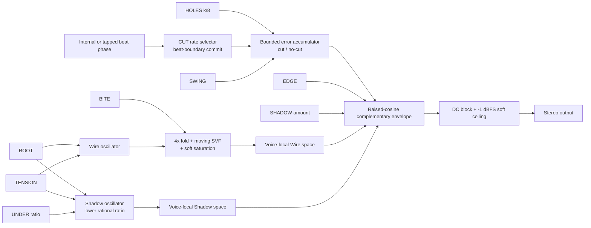

# Wirefall (working name): tension-driven hocket drone

> Status: proposed; research and design evidence only
> Proposal revision: 0.1
> Work type: new design
> Original idea: A performative gated drone with one knob that drives a
> squealing, distorted high voice toward higher pitch and greater energy, and
> another knob that controls the gate rhythm so gaps either become silence or
> a harmonizing lower-pitched counter-sound; designed to be played by turning
> knobs over an external rhythm.
> Implementation target: controller-independent Schuss instrument proposal
> with a provisional Gills performance configuration; Instrument Lab v1
> portable-Core and deterministic-renderer trial first; Ksoloti compatibility
> unresolved
> Working artifact and evidence level: after approval, a JUCE-independent
> C++17 `wirefall_core_tests` plus deterministic `wirefall_render`; the highest
> first-slice claim is host signal, not real-time, device, listening, or
> production integration
> Decision gate: approve this exact proposal revision before creating the
> implementation-ready bundle or writing DSP code.

## 1. Product thesis

### One-sentence thesis

**HYPOTHESIS:** Wirefall is a two-hand drone instrument in which `TENSION`
winds a high `Wire` voice upward through pitch, fold, resonance, and
gain-compensated drive, while `CUT` changes the timescale at which a clocked
rhythm removes that voice; each removed span is either real silence or a
phase-related low `Shadow` voice.

### Instrument identity

The instrument is not a drone followed by a generic step gate. It is one
complementary voice system. The performer keeps one hand on `TENSION` and the
other on `CUT`:

- Turning `TENSION` clockwise raises the Wire's fundamental, shifts a resonant
  emphasis upward, increases folding and soft saturation, and applies fixed
  compensation so “more energy” is carried mainly by pitch and spectrum rather
  than an uncontrolled jump in level.
- Turning `CUT` clockwise moves from an uninterrupted drone through slow holes,
  beat-level cuts, triplet-like motion, and fast stutter. Changes commit on the
  next beat boundary, so a knob turn is a rhythmic cue rather than an arbitrary
  mid-cycle discontinuity.
- `SHADOW` makes the negative space playable. At zero, a cut is silence. Above
  zero, the same complementary envelope reveals a cleaner oscillator at a
  lower rational pitch relationship. The low voice never gets an independent
  sequencer in v0.

The intended performance arc is `thread -> strain -> break -> undertow`:

1. begin with an open, moderately bright drone;
2. wind `TENSION` until the tone becomes a narrow, distorted wire;
3. introduce slow gaps with `CUT`, then turn into faster interruptions against
   the surrounding beat; and
4. bring up `SHADOW` so the missing spans become a lower answer rather than a
   constant bass layer.

`Wirefall`, `Wire`, `Shadow`, `TENSION`, and `CUT` are working interface names,
not allocated Schuss identities or approved product branding.

### Intended user and musical situation

This is for a performer who wants one immediately legible voice to twist over
drums, a sequencer, or a live rhythmic bed without programming a melody or a
32-step pattern. The primary skill is timing knob moves: opening space,
escalating the high register, briefly forcing true silence, and deciding when
the low response should occupy the gap.

It should also work without external synchronization. The first prototype uses
an internal or tapped tempo. External clock is a later control-source concern,
not a prerequisite for testing the sound and gesture.

### In scope

- A new controller-independent instrument identity and a source-neutral signal,
  control, state, timing, safety, and experiment proposal.
- A bounded high voice whose central macro couples pitch and spectral energy
  without raw or unbounded audio feedback.
- A clocked interruption scheduler with a dedicated rate macro, a separate cut
  density, and deterministic reset.
- Exact complementary routing between high Wire, silence, and low Shadow.
- A complete provisional mapping for the reviewed Gills v0.6 panel: ten
  performance pots, four buttons, encoder, OLED, and LEDs.
- Adjacent-product, synthesis, rhythm-algorithm, situated musical-practice, and
  computer-science transfer research.
- A falsifiable Instrument Lab v1 experiment with ordinary square gating and a
  continuously mixed low voice as comparators.

### Out of scope

- DSP implementation, an implementation bundle, app launch, physical audio or
  MIDI access, controller configuration, listening, target build, hardware, or
  publication in this proposal turn.
- Allocating a Schuss stable ID, component contract, DSP graph, instrument,
  performance graph, implementation provider, backend, project, record set, or
  evidence claim.
- Executing Task 034 performance-control graphs or activating Task 033 Phase 3.
- Copying product DSP, presets, waveforms, samples, graphics, panel language,
  or proprietary behavior.
- Reusing Cinderwheel's musical Core, scheduler, state model, or identity.
  Instrument Lab mechanics may be linked after approval, but Cinderwheel is a
  regression consumer, not a superclass or sonic template.
- A Ksoloti/Gills compile, fixed-point design, resource promise, connected
  panel claim, or audible-quality claim.
- A culturally named mode, preset, rhythm, sample, visual motif, or claim that
  the instrument performs Jamaican dub.

## 2. Inputs, constraints, and decision rights

### Inputs and assumptions

- **EVIDENCE:** The user's request defines five required behaviors: a sustained
  drone, a squealing/distorted upper character, an energy macro that also rises
  in pitch, a performable gate-rate macro, and a choice between silence and a
  lower related sound in the gaps.
- **EVIDENCE:** Current Schuss architecture keeps instrument, performance-control
  graph, performance configuration, device profile, DSP graph, backend, and
  target independent. Task 034 structurally defines that reference direction
  but does not execute controller graphs or physical I/O.
- **EVIDENCE:** The reviewed Gills profile has ten 12-bit performance pots,
  four buttons with press/release/hold gestures, one relative encoder with a
  push switch, OLED text/graphics, and six logical LED outputs. This proposal
  maps those declared slots only; it does not infer optional CV hardware or a
  connected device.
- **EVIDENCE:** Instrument Lab v1 is the repository's non-production path from
  an approved implementation-ready bundle to a portable Core, deterministic
  renderer, bounded host shell, promotion-needs report, and level-specific
  evidence. It does not design or promote the instrument.
- **EVIDENCE:** The repository has no active implementation task. The next
  candidate task remains unactivated, so this proposal allocates no shared
  semantic or governance identity.
- **INFERENCE:** A portable float32, 48 kHz, Core-only render trial is the
  cheapest honest test of the requested interaction. Embedded-first work would
  mix a musical experiment with fixed-point and resource questions.
- **UNRESOLVED:** The final base pitch range, preferred Shadow ratio, number of
  useful `CUT` rate zones, external clock source, embedded target, and whether
  the working name survives listening.

### Deliverables

This revision delivers one Markdown proposal containing:

1. a decomposed performance identity and adjacent landscape;
2. cited synthesis, rhythm, cultural-practice, and computer-science research;
3. executable signal, scheduler, state, timing, control, and failure contracts;
4. a provisional complete Gills mapping that remains outside instrument
   identity;
5. literal host-signal experiments, comparators, tolerances, retention rules,
   and stop conditions; and
6. an approval gate into the Sonic Research Lab bundle and Instrument Lab v1
   workflow.

No source, build, app, device, or audio deliverable is authorized here.

### Acceptance tests

- Every characteristic in the original idea has one explicit architectural
  home and at least one falsifying observation.
- `TENSION` cannot create unbounded feedback or exceed the stated output bound.
- `CUT` has a finite rate set, hysteresis, commit timing, and reset behavior.
- Wire, silence, and Shadow gains are complementary by construction; Shadow at
  zero produces measurable interior silence.
- All ten Gills performance pots, four buttons, encoder gestures, OLED, and
  LED roles are accounted for without controller-to-DSP shortcuts.
- Reference evidence, inference, hypothesis, and unresolved facts remain
  separate.
- The musical-practice translation uses structure and attribution without
  copying repertoire, identity, samples, or marketing language.
- The minimal experiment can reject the special scheduler, the complementary
  voice, or the coupled energy macro independently.

### Decisions this work may make

- The working musical identity, public macro names, signal flow, original DSP
  equations, finite parameter ranges, state semantics, provisional control
  mapping, experiment, comparators, and pivot thresholds.
- That the first proof target is an Instrument Lab v1 portable Core and
  deterministic offline renderer at host-signal evidence.
- That external synchronization and JUCE are deferred until Core and renderer
  evidence justify them.

### Decisions this work must not make

- Any canonical Schuss identity, provider eligibility, compiler support,
  backend selection, device binding, target compatibility, or task activation.
- That a source page, design equation, passing test, rendered WAV, or built app
  proves real-time behavior, device execution, listening quality, or product
  readiness.
- That bounded prior-art searches establish novelty.
- That research into Jamaican dub authorizes cultural naming, copied content,
  authenticity claims, or representation of its communities and histories.

### Working definition

Wirefall v0 is “working” only when an approved, fingerprinted implementation
bundle has produced the two named Core-only artifacts below through Instrument
Lab v1 and all frozen source/host-signal checks pass.

| Artifact | Evidence level | Required observation | Explicitly not implied |
|---|---|---|---|
| `wirefall_core_tests` | source and host structural | Fixed-capacity Core, controls, scheduler, state operations, block partitioning, safety, and negative cases pass without JUCE | Useful sound, real-time callback fitness, Gills, Ksoloti, or production graph support |
| `wirefall_render` | host signal | Five deterministic render conditions, ledgers, measurements, comparator results, hashes, and repeat reproduction meet Section 11 | Launched app, physical control, deadline, listening, target build, distribution, or production integration |

## 3. Reference anatomy

The reference is the user's described behavior. The technical mechanisms in
this table are proposals, not claims about an unseen product.

| Function | Observable behavior | Evidence | Keep, transform, or reject | Confidence |
|---|---|---|---|---|
| Sustained body | A drone remains available while the performer works the controls. | User request | **Keep:** no note sequencer or envelope is required to sustain the Wire. | High |
| Upper squeal | The sound is distorted, animated, and weighted toward the higher register. | User request | **Transform:** use bounded fold, resonant emphasis, and saturation rather than uncontrolled audio feedback. | Medium until listening |
| Energy gesture | Turning one knob makes the sound feel more energized and higher in pitch. | User request | **Keep as one coupled macro:** pitch, fold drive, filter center/Q, and saturation rise on documented curves; raw level is compensated and bounded. | High as design, unproved perceptually |
| Gate rhythm | A second knob changes the rhythm at which the sound briefly disappears. | User request | **Keep:** `CUT` chooses one clock-related interruption timescale, not a pattern page. | High |
| Negative-space behavior | A gap may be true silence or contain a lower harmonizing/juxtaposing sound. | User request | **Keep and formalize:** one complementary envelope routes the gap to silence or Shadow; it never starts an independent bass sequence. | High |
| Knob performance | The instrument should reward live turning over an existing rhythm. | User request | **Keep:** two adjacent primary pots, beat-boundary rhythm commits, momentary Void/Open buttons, and no required menu. | High as intent, listening/device unproved |

## 4. Adjacent landscape

| Product or project | Type | Relevant mechanism | Distinguishing behavior | Source | Design implication |
|---|---|---|---|---|---|
| SOMA LYRA-8 | Hardware drone synthesizer | Held voices, cross-modulation, delay feedback, distortion, knob-only drone performance | Its manual explicitly invites HOLD plus knob performance and describes rhythmic pulsations and near-self-oscillating delay behavior. | [SOMA LYRA-8 manual](https://somasynths.com/wp-content/uploads/2019/06/LYRA-8_manualEng_V2.0.pdf) | Confirms that a nonlinear drone can be an instrument of continuous knob gestures. Wirefall should keep that immediacy but use deterministic, bounded rhythmic interruption. |
| UVI Drone | Software instrument | Multi-layer drone, feedback, distortion/harmonics, and up-to-32-step gate sequencer | A broad sample/granular environment with a detailed sequencer and modulation pages. | [UVI Drone](https://www.uvi.net/drone) | Gated drones are common. Wirefall should avoid a pattern editor and test whether two macros are a coherent smaller instrument. |
| Cherry Audio DS-2 Pulser | Software effect inside a synthesizer | 16/32-step synced or free gate sequencer with speed, attack, sustain, and direction | It explicitly turns sustained sounds and drones into rhythmic patterns. | [DS-2 effects documentation](https://docs.cherryaudio.com/cherry-audio/instruments/ds-2/effects) | Speed-controlled drone chopping is prior art; `CUT` alone is not a novelty claim. |
| Gamechanger Audio PLASMA Voice | Eurorack voice | Intentionally harsh timbres plus trigger, gate, loop, always-on, duck, starve, pitch-jump, and burst responses | Gates can alter more than output amplitude, and pitch jumps span a wide range. | [PLASMA Voice manual](https://gamechangeraudio.com/wp-content/uploads/2024/04/PlasmaVoice_instruc_WEB_v2.2.pdf) | Supports treating gates and high-energy timbre as an integrated voice interaction, but Wirefall must not imitate its plasma technology, sound bank, or panel. |
| G8 Gate | Software gate effect | Cyclic gating and an opposite envelope output | Complementary gating can split two amplitude roles. | [G8 documentation](https://g8-gate.readthedocs.io/en/latest/introduction.html) | Inverted gates are established technique. Wirefall's claim must rest on its coupled voice/control identity, not inversion itself. |
| Effin | Community ZOIA patch | Two-track mixable hocket sequencer with a simple FM demo voice | Explicit hocketing between two tracks. | [Effin patch description](https://patchstorage.com/effin-a-two-track-mixable-hocketing-sequencer/) | Hocketing sequencers exist; Wirefall deliberately has one sound relationship and no two-lane composition UI. |
| Cinderwheel | Local Schuss research prototype | Four-stage Tide Pit-shaped cycle, Undertow, bounded resonant Wake, and rotor-routed afterstrikes | It explores resonance-driven counterpoint inside a granular/feedback successor. Listening and production integration remain separate. | [Cinderwheel proposal](./cinderwheel.md) and [trial results](../prototypes/cinderwheel/RESULTS.md) | Wirefall must remain a simpler negative-space drone, not another Tide Pit successor, event-energy resonator, or rotor scheduler. |

**BOUNDED SEARCH RESULT:** Searches on 2026-08-21 included `drone
synthesizer feedback distortion rhythmic gate`, `complementary gate high low
voice drone synthesizer`, `hocket synthesizer complementary gate sequencer`,
`Bresenham rhythm sequencer music audio gate`, and `pulse density rhythm
generator Eurorack sequencer`. They found every major ingredient and several
two-part combinations. They did not establish a product with this exact
`TENSION`/`CUT`/continuously variable silence-to-Shadow interaction. That is
not proof of absence, uniqueness, or patent freedom.

## 5. Synthesis and engineering research

| Paper, standard, or technical source | Mechanism | Evidence strength | Applicability | Limitation |
|---|---|---|---|---|
| Esqueda, Pöntynen, Parker, and Bilbao, “Virtual Analog Models of the Lockhart and Serge Wavefolders” (2017) | Nonlinear folding produces new spectral content and requires an explicit antialiasing strategy; the paper evaluates antiderivative antialiasing. | Peer-reviewed open paper: [Aalto record and DOI](https://aaltodoc.aalto.fi/items/9701be87-36a8-43ae-b3dc-a7ab7ac5529a) | Supports a folded high voice and the requirement for oversampled/reference comparison. | Wirefall does not claim to emulate either analog circuit; v0 uses an original analytic fold and fixed oversampling. |
| Andrew Simper, Cytomic trapezoidal SVF papers | Topology-preserving state-variable filtering with independently useful low/band/high outputs and stable coefficient forms. | Maintainer/author technical material: [Cytomic papers](https://cytomic.com/technical-papers/) | Supplies the exact filter family to freeze in the implementation bundle for moving resonant emphasis. | Web material is design evidence, not copied source. Download terms and exact equations must be reviewed before implementation; Ksoloti cost is unproved. |
| Bresenham, “Algorithm for Computer Control of a Digital Plotter” (1965) | An integer error accumulator distributes discrete steps while approximating a continuous slope using bounded addition/subtraction. | Original IBM Systems Journal paper: [PDF](https://ibm-1401.info/Pics3/bresenham1965.pdf) | Maps cleanly to distributing `k` cut slots among `n` opportunities with fixed state and work. | The home-domain algorithm is not musical evidence and does not justify novelty. |
| Gómez-Martín, Taslakian, and Toussaint, “Evenness Preserving Operations on Musical Rhythms” (2008) | Formalizes maximal evenness and operations including complementation and alternation. | Conference paper and institutional record: [UPM archive](https://oa.upm.es/4406/) | Confirms that evenly distributed rhythms and their complements are explicit prior art. | Mathematical evenness does not guarantee groove, meter clarity, or playability. |
| Milne and Dean, “Computational Creation and Morphing of Multi-level Rhythms by Control of Evenness” (2016) | Parameterized rhythm transformation and gap-filling at several levels. | Peer-reviewed Computer Music Journal article metadata and abstract: [Western Sydney University](https://researchers.westernsydney.edu.au/en/publications/computational-creation-and-morphing-of-multilevel-rhythms-by-con/) | Shows that continuous rhythm/evenness control is established design space. | The full hierarchy is more complex than this two-macro instrument and is rejected for v0. |
| Schuss Instrument Lab v1 workflow | Portable Core, fixed mechanical host boundary, objective renderer artifacts, noncanonical topology, validation, reproduction, and evidence separation. | Current local workflow: [`docs/workflows/instrument-development.md`](../../docs/workflows/instrument-development.md) | Gives the approved post-proposal experiment path without copying Cinderwheel's scaffold. | It does not supply musical DSP, state, controls, comparators, or a production promotion. |

**DESIGN INFERENCE:** A bandlimited sinusoidal source followed by a bounded
analytic folder, a finite-Q moving SVF, and soft saturation can produce the
requested strained upper character without a free-running audio-feedback loop.
That is a safety-oriented architecture hypothesis, not an audible result.

## 6. Musical-practice research

| Named practice, community, place, and period | Source and source relationship | Structural principle | Possible translation | Context or restriction | Risk |
|---|---|---|---|---|---|
| Jamaican dub mixing associated with Kingston studios and sound-system culture, late 1960s through 1970s | Jamaica's National Library situates King Tubby's work and the prominence of bass/drums; the Jamaica Information Service names Tubby, Lee “Scratch” Perry, Errol Thompson, and others as pioneers rather than reducing the practice to one inventor. See [National Library of Jamaica](https://www.nlj.gov.jm/REGGAE%20EXHIBITION/King%20Tubby.htm) and [Jamaica Information Service](https://jis.gov.jm/jamaica/dub/). | The mix is performed: elements are brought forward, removed, and returned against a rhythm foundation; absence and low-frequency continuity can reorganize attention. | Treat `VOID`, `OPEN`, `TENSION`, and `SHADOW` as live arrangement gestures. The low Shadow is not a wallpaper bass voice; it becomes audible specifically when the upper Wire is removed. | Dub is bound to Jamaican recording practice, sound systems, musicians, engineers, versioning, social history, and particular recordings. A synthesized two-voice gate loses almost all of that context. | Calling the product or a preset “dub,” imitating a named riddim, or claiming authenticity from desk research. |
| Hopeton Overton Brown (“Scientist”), Jamaican recording engineer, reflecting on work at King Tubby's and Channel One | In a practitioner interview, Scientist describes high-pass-filter technique, rapid one-take working conditions, and the importance of controlled bleed rather than mechanically gating everything. See [Tape Op interview](https://tapeop.com/interviews/136/hopeton-overton-brown-scientist). | Fast technical manipulation is judged by the whole mix; strict isolation can sound stiff, while controlled overlap preserves life. | Keep crossfade edges variable and test Shadow overlap rather than equating “harder gate” with “better rhythm.” The instrument must remain playable without a screen. | One interview cannot stand for dub as a whole, and the design does not reproduce Scientist's console, methods, recordings, or authority. | Cherry-picking technical anecdotes as exotic validation for an unrelated synth. |

### Ethical and design boundary

- The translated principle is **performative removal and return against a
  stable rhythmic ground**, not a rhythm, timbre, recording, name, or claim of
  Jamaican identity.
- No riddim, bass line, vocal, sample, impulse response, console emulation,
  artwork, patois, artist name, sacred/private material, or preset label is
  borrowed.
- The proposal cites its research relationship, but Wirefall is not presented
  as “authentic dub” or as representing Jamaican communities.
- If future branding, presets, demonstrations, or marketing make dub central,
  practitioner collaboration, review, credit, licensing where applicable, and
  compensation become required before publication.

## 7. Computer-science transfer search

| Rank and concept | Existing audio prior art found | Proposed mapping | Musical benefit | Failure mode | Falsifying experiment |
|---|---|---|---|---|---|
| **1 — selected:** incremental error/discrepancy accumulator from raster graphics | Euclidean/maximally even musical rhythms, hardware/software Euclidean sequencers, and continuous evenness morphing are established. The exact Bresenham name is not important and is not a novelty claim. | At each rhythmic opportunity, add integer `k` to an error state; emit one cut when the state crosses fixed denominator `n=8`, then subtract `n`. `HOLES` chooses `k`; `CUT` chooses opportunity rate. | Fixed work, exact repeatability, no pattern memory, and evenly spaced cuts that can be changed by one knob. | It may sound like a sterile square LFO or create no useful groove beyond regular tremolo. | Match mean cut rate/duty with an ordinary square gate. If the special scheduler is not reliably preferred or distinguished, use the simpler gate. |
| **2 — selected:** set complementation / two-color occupancy | Complementary/inverted gate outputs, hocket sequencers, and mathematical rhythm complementation already exist. | The same bounded crossfade coordinate `q` drives Wire with `cos(pi*q/2)` and Shadow with `sqrt(S)*sin(pi*q/2)`. Shadow at `S=0` leaves silence. | The performer controls whether absence is empty or answered without aligning a second sequencer. | It may sound like obvious A/B switching, or the low voice may mask the desired cut. | Compare complementary Shadow with the same low voice mixed continuously. Reject or reduce Shadow if listeners cannot hear clearer negative-space organization. |
| **3 — rejected for v0:** hierarchical gap filling / multi-level evenness morph | Milne and Dean explicitly describe higher rhythmic levels filling lower-level gaps under parameterized control. | Several nested schedulers would place Wire, Shadow, noise, and tail at different levels. | Greater rhythmic variety from a small control surface. | It turns a direct two-hand instrument into an algorithmic rhythm workstation and obscures cause/effect. | Do not implement in v0; reconsider only if the simple complement passes but becomes predictably exhausted in listening. |

**PROPOSED CONTRIBUTION, BOUNDED:** The candidate contribution is an
interaction grammar, not a new rhythm or synthesis algorithm: a single coupled
upper-energy macro is performed against a single interruption-rate macro, and
one continuous control decides whether the resulting negative space is empty
or occupied by a related lower voice.

## 8. Novelty map

### Common elements

- Sustained drone oscillators and held voices.
- Waveshaping, resonance, saturation, self-oscillation-like timbres, and high
  spectral energy.
- Tempo-synchronized gates, step gates, tremolo, stutter, and gate-rate knobs.
- Sub-octave or rationally related voices.
- Inverted/complementary gates and hocketing sequencers.
- Euclidean or maximally even trigger distribution.

### Less-common combinations found

- LYRA-8 combines knob-performed drone, nonlinearity, feedback, and rhythmic
  pulsation, but not this clocked complementary-voice model.
- PLASMA Voice integrates harsh sound generation with many gate behaviors, but
  through proprietary plasma/sound-bank architecture rather than a coupled
  tension drone.
- UVI Drone and DS-2 combine drones with programmable gate sequencers, but
  expose step/pattern systems rather than making two adjacent pots the musical
  center.
- Formal rhythm research and gate tools explicitly cover complementation, so
  routing Shadow into the gaps is known technique.

### Proposed contribution

**HYPOTHESIS:** What may make Wirefall distinctive is the deliberately narrow
performance plane:

```text
                 CUT: open -> holes -> beat cuts -> triplet tension -> stutter
TENSION: low     thread       thread with air       low answering shadow
         high    strained     sliced upper wire     violent high/low hocket
```

The research did not establish that this plane is new, patentable, or absent
from commercial plugins, modular patches, or private instruments. “Coherent
and testable proposal” is justified; “first,” “unique,” and “novel” are not.

### Rejected directions

| Direction | Reason rejected | Evidence or risk |
|---|---|---|
| Raw output fed back into its own trigger or pitch detector | Cut density, pitch, and work would depend on saturated peaks and numerical accidents. | Unbounded event causality and poor reset equivalence. |
| `TENSION` as simple volume plus pitch | The gesture would become “louder” rather than more spectrally energized and could damage headroom. | User asked for energy and high-end character, not only amplitude. |
| A 16/32-step pattern editor | It duplicates well-covered products and weakens knob immediacy. | UVI Drone and DS-2 already demonstrate the generic design. |
| Independent bass sequencer | It creates a two-lane composition instrument rather than a high voice with a lower negative-space relation. | Increased controls, tuning state, and rhythmic ambiguity. |
| Random/probability pattern mutation | It makes live knob cause/effect harder to learn before the core interaction is proved. | No randomness is necessary to answer the first hypothesis. |
| Reverb after the complementary gate | A tail would fill intervals that are promised as true silence. | `VOID` must be objectively silent after its bounded edge. |
| Dub product/preset naming or copied Jamaican rhythm content | The structural research does not grant identity or repertoire rights. | Section 6 ethical boundary. |
| Schuss production integration or embedded-first implementation | Current production execution/provider/target decisions are outside an instrument experiment. | Architecture and evidence boundaries; unnecessary first-slice risk. |

## 9. Recommended architecture

### Signal flow



Two independent, fixed-capacity space paths sit before the complementary VCA;
Wire and Shadow do not share delay state. When `SHADOW=0`, an interior cut
therefore mutes Wire dry signal and tail together without leaking a Shadow
tail. The scheduler never observes audio and the nonlinear Wire never
generates control events.

### Executable DSP contract

All normalized parameters are clamped to `[0,1]`. `Fs=48000` for the first
slice. Nonlinear Wire processing runs at `4*Fs`; control/scheduler state remains
at base rate. The implementation bundle must freeze the exact Cytomic SVF
equations and generated FIR coefficients before DSP edits.

| Mechanism | Equation or pseudocode | Coefficients/ranges | Gain and stability bound | Update timing | Failure behavior |
|---|---|---|---|---|---|
| Smoothed controls | `a=exp(-1/(tau*Fs)); z[n]=a*z[n-1]+(1-a)*target` | `TENSION` 25 ms; `ROOT` 15 ms; continuous timbre controls 10 ms; `SHADOW` 8 ms | Input and state clamped; no smoothing state may become non-finite. | Per sample; derived filter coefficients every 16 base-rate samples | Non-finite target is ignored and counted; non-finite state triggers contained voice reset. |
| Wire pitch | `fW=clamp(fRoot*2^((42*E^1.35)/12),40,6000)` | `fRoot=55*2^(2*ROOT)` Hz, so 55–220 Hz; `E=TENSION` | Proposed normal maximum is about 2.49 kHz before upper harmonics; absolute 6 kHz clamp | Phase increment per 4x sample; target smoothed at base rate | Clamp and diagnostic on invalid/above-range input. |
| Wire source and fold | `x=.82*sin(phi)+.18*sin(2*phi+.31)`; `u=(1+7*E^2)*x`; `fold(u)=2/pi*asin(sin(pi*u/2))` | Fold input gain 1–8 | Analytic fold output is in `[-1,1]`; 4x processing and reference null test are mandatory. | Per 4x sample | If fold is non-finite, zero that sample, reset nonlinear state, and count containment. |
| Wire resonant emphasis and drive | TPT SVF band output `bp` at `fc=min(.42*Fs,fW*(1.35+1.15*BITE))`; `Q=.8+14*E^2*(.25+.75*BITE)`; `d=1+6*E^2`; `c=1/sqrt(1+.9*E+1.1*E^2)`; `w=c*tanh(d*(.68*fold+.32*bp/sqrt(Q)))/tanh(d)` | `Q` 0.8–14.8; `d` 1–7; fixed compensation `c` 1–0.577 | Finite Q, band normalization, fixed energy compensation, `tanh`, and final ceiling bound amplitude; no self-trigger/audio event path | SVF per 4x sample at `Fs_os=4*Fs`; coefficients every 16 base samples | Invalid coefficient mutes/resets the SVF branch over 5 ms; oscillator phase and scheduler survive. |
| Oversampling filter | With `sinc(x)=sin(pi*x)/(pi*x)` and `sinc(0)=1`, 63-tap Blackman-windowed sinc at 192 kHz: `h[m]=2*fc*sinc(2*fc*(m-31))*[.42-.5*cos(2*pi*m/62)+.08*cos(4*pi*m/62)]`, `fc=18000/192000`, normalized so `sum(h)=1`; interpolation applies gain 4 | Fixed 63 taps; coefficients generated once by the bundle and byte-checked | Fixed FIR; 8x reference render must place 4x residual below Section 11 threshold | Per 4x sample with fixed ring buffer | Coefficient/hash drift fails readiness; no fallback to unfiltered nonlinear output. |
| Shadow voice | `r in {1/4,1/3,1/2,2/3,3/4}`; `fS=clamp(r*fW,27.5,4000)`; `s0=.82*sin(phiS)+.18*sin(2*phiS)`; `a=exp(-2*pi*min(4*fS,6000)/Fs)`; `lp=(1-a)*s0+a*lpPrev`; `s=tanh(1.4*lp)` | Default `r=1/2`; two fixed Shadow oscillator slots permit ratio crossfade | Oscillator/filter/saturation bounded; ratio change uses 20 ms equal-power crossfade | Per base sample | Invalid ratio returns to `1/2` and records a diagnostic. |
| CUT rate | `rateTable={OPEN,0.5,1,1.5,2,3,4,6,8}` opportunities per beat; one of nine equal pot zones with `0.015` normalized hysteresis | `OPEN` emits no cuts; internal tempo 30–240 BPM | No audio-rate scheduling; a rate change commits on next beat and preserves transport phase | Zone detection at control rate; commit at beat boundary | If clock is absent/invalid, use retained internal tempo; external clock is not part of v0. |
| Cut distribution | On each opportunity: `err+=k; if err>=8 {cut=1; err-=8} else cut=0`; `k=round(1+5*HOLES)` gives 1–6 | Fixed denominator 8; one bit per opportunity; no randomness | Constant work, fixed state, at most one new cut decision per opportunity | Opportunity boundary; `HOLES` change commits at next beat and resets `err=0` | Invalid state resets at the next beat and raises scheduler diagnostic; audio continues open until then. |
| Swing | Odd opportunities are displaced by `delta=(SWING-.5)*slot`, with effective swing 50–68%; even/odd pair duration remains exact | `SWING` maps 0–1 to 0.50–0.68; default 0.50 | Boundary times clamped strictly increasing with at least 32 samples separation | Scheduler computes next boundary only | At tempo/rate extremes that violate separation, clamp toward 50% and count. |
| Complementary envelope | Let `b` be cut state and `q` a raised-cosine ramp toward `b`: `R(u)=.5-.5*cos(pi*u)`. `gW=cos(pi*q/2)`; `gS=sqrt(SHADOW)*sin(pi*q/2)`; `y=gW*w+gS*s` | `EDGE` maps to `tau=1.5+28.5*EDGE^2` ms, then `tau=min(tau,.45*currentSlot)` | At `SHADOW=1`, equal-power gains; at zero, cut interior is silence. A new edge begins from current `q`, never from an assumed endpoint. | Per base sample | Slot too short clamps edge; impossible/non-finite state ramps to open Wire over 5 ms and counts. |
| Pre-gate space | Each voice owns an independent stereo cross-delay pair, 67 ms L and 89 ms R; `feedback=.32*SPACE`; wet mix `.28*SPACE`; `tanh` in feedback | Four fixed delay buffers total; `SPACE` 0–1 | Feedback magnitude <=0.32 and saturation; fixed memory. The complementary VCA follows both wet/dry voice paths. | Per base sample | Corrupt state clears only that voice's two buffers over a 5 ms wet fade; its dry signal continues. |
| Output safety | DC blocker `R=exp(-2*pi*10/Fs); dc=x-xPrev+R*dcPrev`; `out=.8912*tanh(dc/.8912)` | Absolute ceiling below `10^(-1/20)` | Finite output and < -1 dBFS sample peak by construction | Per output sample | Any non-finite output writes zero, latches a diagnostic, and begins 10 ms Panic. |

### State and timing model

- **Event convention:** events at absolute sample `n` are ordered by
  `(sample_index, ingress_sequence)` and applied before rendering sample `n`.
  The first slice accepts at most 128 events per host block; excess newest
  events are dropped and counted. This cap is host mechanics, not a device
  claim.
- **Block equivalence:** audio and event ledgers for one accepted event stream
  must be independent of block partition. Oscillator, filter, delay, ramp,
  scheduler, tempo, and diagnostics live in Core state, not host-block locals.
- **Rhythm commits:** `CUT` and `HOLES` changes are pending until the next beat
  boundary. Their display may show `pending -> active`; the renderer ledger
  records both samples. `EDGE`, `TENSION`, `SHADOW`, and timbre controls remain
  continuous.
- **Downbeat:** a downbeat action resets beat phase and error accumulator but
  does not reset oscillator, filter, delay, or parameter state.
- **Reset:** full Reset ramps output to zero over 5 ms, restores oscillator
  phases, SVF/delay/smoothing/scheduler state and defaults, then ramps up over
  5 ms. The state-equivalence rule is byte equality after removing absolute
  event `sample_index` and diagnostic monotonic counters.
- **Panic:** Panic ramps to zero over 10 ms, clears delay/filter/rhythm state,
  cancels pending commits, and remains silent until explicitly released or
  Reset. It does not silently restore output.
- **Freeze/capture:** none in v0. No held audio, random state, pattern memory,
  preset, or mutation state exists.
- **Mode/ratio change:** Shadow ratio uses two preallocated oscillator slots and
  a 20 ms equal-power crossfade. `FLIP` begins from the current complementary
  coordinate and does not restart the clock.
- **Recall:** serialized recall is out of the first slice. A future proposal
  revision must define versioning, pending rhythm commits, delay state, and
  exact reset equivalence before adding it.
- **Reconnect/clock loss:** there is no physical controller or external clock
  in v0. Later adapters may map a source to public tempo/transport controls;
  they may not alter Core timing semantics.
- **Non-finite recovery:** containment is branch-local where possible. Three
  contained failures within one second escalate to Panic; counters never
  become audio modulation.

### Control and performance mapping

The instrument facets below are controller-independent. The Gills column is a
provisional performance configuration against the reviewed profile, not a
canonical record or direct device-to-DSP map.

| Gills control or gesture | Public control | Range or states | DSP mapping | Perceptual role | Safety or pickup behavior |
|---|---|---|---|---|---|
| Pot 1 | `TENSION` | 0–1, default 0.38 | Section 9 pitch/fold/Q/drive curves | Primary left-hand energy gesture | 25 ms smoothing; no raw level mapping |
| Pot 2 | `CUT` | nine zones, default `OPEN` | Rate table with hysteresis and beat-boundary commit | Primary right-hand rhythm gesture | Pending zone shown; no mid-beat jump |
| Pot 3 | `SHADOW` | 0–1, default 0 | Complement gain `sqrt(S)` | Silence -> low answer | 8 ms smoothing; zero is tested true gap |
| Pot 4 | `ROOT` | 55–220 Hz, default A2=110 Hz | Two octaves exponential | Register before escalation | 15 ms smoothing; Wire/Shadow share target |
| Pot 5 | `BITE` | 0–1, default 0.55 | SVF center/Q contribution | Thin glass -> nasal squeal | Finite Q and coefficient clamp |
| Pot 6 | `HOLES` | integer `k=1..6`, default 3 | Error-accumulator numerator over 8 | Sparse -> dense interruption | Beat-boundary commit; fixed work |
| Pot 7 | `EDGE` | 1.5–30 ms, default 4 ms | Complement ramp time | Hard chop -> pulled/bleeding edge | Clamped to 45% of current slot |
| Pot 8 | `UNDER` | `1/4,1/3,1/2,2/3,3/4`, default `1/2` | Shadow pitch ratio | Deep sub -> close lower relation | Detent hysteresis; 20 ms ratio crossfade |
| Pot 9 | `SWING` | 50–68%, default 50% | Alternating opportunity displacement | Straight -> leaning cut placement | Strictly increasing boundary clamp |
| Pot 10 | `SPACE` | 0–1, default 0.12 | Bounded 67/89 ms pre-gate cross-delay | Width and metallic wake within active spans | Delay is gated too; feedback <=0.32 |
| Button 1 press/release | `VOID` | momentary while pressed | Forces effective Shadow to zero | Turn answers into real holes | Immediate 3 ms override ramp; knob state retained; hold adds no second action |
| Button 2 press/release | `OPEN` | momentary while pressed | Forces Wire open while scheduler continues | Drop the gate, then release back into phase | Immediate 3 ms override ramp; does not reset/pause rhythm; hold adds no second action |
| Button 3 release <600 ms | `FLIP` | normal / flipped | Swaps which voice owns scheduler `cut` state | Low bed with high flashes | 10 ms complementary transition |
| Button 3 hold >=1200 ms | `FLIP_CANCEL` | action | Returns to normal on next beat | Predictable recovery | A hold does not also fire the tap action |
| Button 4 release <600 ms | `DOWNBEAT` | action | Beat phase and `err=0` | Re-seat the pattern on the rhythm | 5 ms edge-safe rhythm transition |
| Button 4 hold >=1200 ms | `PANIC` | latched action | Section 9 Panic | Guaranteed silence/recovery | Must be released/reset explicitly |
| Encoder turn | `TEMPO` | 30–240 BPM, default 120 | Log-like steps: 1 BPM under 160, 2 BPM above | Match surrounding rhythm | Retained internal clock only in v0 |
| Encoder push release <600 ms | `TAP_TEMPO` | median of last 3 valid intervals | Valid inter-tap intervals 250–2000 ms | Set tempo without display editing | Invalid interval ignored; no single-tap jump; holds are excluded |
| Encoder hold >=1200 ms | `RESET` | action | Full musical reset | Known starting point | 5 ms down/up ramps |

Provisional feedback:

- OLED line 1: `120 BPM  CUT x4`; line 2: `E 0.62  SH 1/2`.
- LED 1 pulses on the beat; LED 2 on a cut boundary.
- LED 3 indicates Shadow audible; its second color indicates `FLIP`.
- LED 4 indicates a pending rhythm commit; red indicates Panic/containment.

No LED color, OLED refresh, button duration, pickup, MIDI, or physical receipt
is proved by this mapping. A later performance configuration must terminate at
public facets and use the exact accepted Gills slots.

### Parameter interactions and edge cases

- `CUT=OPEN` ignores `HOLES`, `EDGE`, and `SWING` acoustically but retains their
  values. Shadow is silent because no gap exists unless `FLIP` is active.
- `SHADOW=0` plus pre-gate space still yields true interior silence because the
  complete wet/dry voice mix is gated afterward.
- At the fastest rate and tempo, `EDGE` is reduced automatically before it can
  consume a slot. The effective value, not only the requested value, enters the
  ledger/display.
- High `TENSION` with `ROOT` at maximum reaches the proposed Wire fundamental
  ceiling but never raises the oscillator past 6 kHz. The 8x reference null
  decides whether the 4x nonlinear path is adequate.
- Changing `UNDER` while Shadow is inaudible still advances both ratio slots so
  the next gap does not expose a stale phase reset.
- `VOID` overrides Shadow without changing the pot; `OPEN` overrides the gate
  without pausing it. Releasing either returns to the current rhythm phase.
- `FLIP` is deliberately the only mode. It may be rejected in listening if it
  weakens the simple identity.
- Tempo changes preserve normalized beat phase. `DOWNBEAT` is the only normal
  phase-reset gesture.

### Failure behavior

- Unknown controls, invalid ranges, non-finite values, unsupported clock
  sources, event overflow, coefficient failure, and state corruption are
  explicit diagnostics; none silently selects a fallback product path.
- Scheduler failure opens Wire until a beat-boundary reset; it never gets stuck
  in an uncommanded permanent mute.
- Branch DSP failure mutes and clears only the affected branch when possible.
  Repeated containment escalates to latched Panic.
- Output is never allowed above the fixed soft ceiling, but this is not hearing
  safety; the proposal's upper-register sound may still be subjectively sharp.
- There is no automatic randomization, preset migration, external-device
  reconnect, dynamic allocation in processing, or network/file work in Core.

## 10. Target and resource feasibility

| Constraint | Assumption or measured value | Evidence | Budget or limit | Status |
|---|---|---|---|---|
| Repository lane | Instrument Lab v1 non-production new-design consumer | Current local workflow and validated shared mechanics | Link shared mechanics; keep musical Core/state/controls/experiment instrument-owned | **EVIDENCE**, implementation not started |
| Numeric/sample format | float32 Core, stereo output, no audio input | Chosen first-slice profile | Exactly 48 kHz; block sizes 1–512 | **PROPOSED** |
| Nonlinear quality | Wire branch at 4x with 63-tap fixed FIR; 8x renderer comparator | Wavefolding research and Section 9 contract | 4x/8x residual threshold in Section 11 | **HYPOTHESIS** |
| Processing state | Oscillators, two Shadow ratio slots, SVF, oversampling FIR, two voice-local stereo delay pairs, scheduler, ramps, diagnostics | Architecture count | <=256 KiB heap-free Core state; no processing-path allocation | **PROPOSED**, unmeasured |
| Event capacity | Bounded host input | Instrument Lab pattern | 128 events per block, overflow counted | **PROPOSED** |
| Host CPU | M1 Pro development Mac | Known local host, not target proof | Core-only renderer <=15% of one performance core at 48 kHz/512 in release; report median and p99 separately | **UNRESOLVED** until measured |
| Latency | FIR group delay plus host block; no lookahead limiter | Section 9 architecture | Report algorithmic frames exactly; no real-time claim | **PROPOSED** |
| JUCE | Not needed for first-slice Core/render proof | Instrument Lab sequencing | Authenticated JUCE target only after Core acceptance and separate scope | **DEFERRED** |
| Gills/Ksoloti | Panel mapping proposed; compute/backend compatibility not selected | Schuss layer boundary | No ARM, Q27/Q31, SRAM, CPU, BUFSIZE, hardware, or audible claim | **UNRESOLVED** |
| Dependencies/licenses | Original C++17 DSP plus repository-owned Instrument Lab mechanics; papers/pages are design evidence, not imported code | Source plan | No package install or copied third-party DSP; review any later JUCE/distribution combination separately | **PROPOSED** |

### Target recommendation

If approved, begin with the Instrument Lab v1 Core-only path. Do not create a
canonical Schuss graph or target build first. The first implementation should
remain source-neutral and should not need JUCE, Mutable Instruments, Ksoloti,
VCV Rack, a controller, or network access.

Ksoloti feasibility is deliberately not inferred. Four-times oversampling,
moving filters, delay memory, float behavior, and control timing must be
measured and then redesigned or rejected for an embedded target under a later
contract.

## 11. Minimal experiment

### Central hypothesis

**HYPOTHESIS:** A performer will hear and learn two substantially independent
axes—upper spectral escalation from `TENSION` and rhythmic negative-space
change from `CUT`—and the complementary Shadow condition will organize the
gaps more clearly than continuously adding the same low voice, without losing
the beat or exceeding the fixed output/safety bounds.

The first experiment may accept objective mechanism/safety claims but cannot
accept playability or sound quality without the separate listening gate.

### Smallest vertical slice

- One JUCE-independent C++17 Core built through Instrument Lab v1.
- Wire oscillator/fold/SVF/drive, Shadow oscillator, internal tempo,
  error-accumulator cuts, complementary envelope, pre-gate space, state
  operations, diagnostics, and output ceiling.
- No GUI, MIDI, external clock, plugin, target lowering, file I/O from Core, or
  canonical Schuss identity.
- One deterministic renderer writing five 32-second stereo WAVs plus ledgers,
  measurements, condition manifest, and SHA-256 hashes.

### Test signals and gestures

Each condition is 32 seconds at 48 kHz and 120 BPM. Control events occur on
literal sample indices. The condition fixture, not compiled renderer code,
owns the timeline.

| Condition ID | Gesture | Purpose |
|---|---|---|
| `WF01_TENSION_OPEN` | `CUT=OPEN`; `TENSION` holds 0.10, 0.30, 0.50, 0.70, 0.90 for four beats each (10 seconds total), performs one 12-second 0.10-to-0.90 sweep, then holds 0.90 for 10 seconds | Test pitch/spectral escalation, level compensation, alias reference, and edge-free smoothing |
| `WF02_VOID` | `TENSION=.72`, `SHADOW=0`, `HOLES=3`; four-second `OPEN` lead, then `CUT` visits x0.5, x1, x1.5, x2, x3, x4, x8 for four seconds each | Test true gaps, beat-boundary commits, cut ledger, and rate legibility |
| `WF03_SHADOW` | Same events as `WF02`, `SHADOW=.80`, `UNDER=1/2` | Test complementary low occupation with identical Wire schedule |
| `CMP01_SQUARE` | Same Wire and mean cut duty/rate as `WF02`, but an ordinary phase-locked square LFO replaces the accumulator | Falsify scheduler complexity; prefer simpler gate if it is equivalent or better |
| `CMP02_PARALLEL_LOW` | Same Wire/Shadow tones and total RMS target as `WF03`, but Shadow is continuously mixed rather than complementary | Falsify the negative-space claim independently of low timbre preference |

| Field | Bound value |
|---|---|
| Sample rate and supported block sizes | 48,000 Hz; partitions `1,16,64,257,512`, maximum 512 |
| Deterministic seed | `0x57495245`; v0 contains no stochastic algorithm and must report the seed unused |
| Event/sample timeline convention | `(sample_index, ingress_sequence)`, applied before sample; condition fixture is authoritative |
| Literal condition IDs and count | The five IDs above; exactly five |
| Falsifying comparator conditions | `CMP01_SQUARE` and `CMP02_PARALLEL_LOW` |
| Output names and kinds | `<id>.wav` 24-bit stereo; `<id>.events.csv`; `<id>.metrics.json`; `wirefall-observation-manifest.json` |
| Objective tolerances | Section 11 Measurements; exact ledger/hash fields are frozen in the implementation bundle |
| Artifact retention policy and location | Retain canonical fixtures, manifest schema, source results, and small JSON/CSV summaries in `research/prototypes/wirefall/`; keep WAVs and build trees ignored under `build/wirefall-*`; record their hashes |

### Measurements

All five conditions must meet:

- no NaN/Inf, denormal runaway, allocation in `process`, event-cap overrun in
  the frozen normal fixture, or sample peak above `0.8912`;
- absolute channel DC mean <=`1e-4` and no scheduler boundary closer than 32
  samples;
- byte-identical event ledgers and WAVs across all five block partitions and a
  fresh repeated block-64 process; if compiler settings prevent byte identity,
  stop and revise the bundle rather than weakening tolerance ad hoc;
- Reset replay equality under the normalized state equivalence in Section 9;
- 4x Wire output versus an otherwise identical 8x reference has RMS null
  <=`-55 dBFS` in `WF01` and no narrow alias component above `-50 dBFS` below
  18 kHz during the highest Tension hold;
- across the five `WF01` holds, estimated fundamental follows the declared
  `fW` within 25 cents and at least four adjacent spectral-centroid changes are
  positive; final centroid is >=1.8 times the first;
- `WF01` final-hold RMS is between 0 and +4 dB relative to the first hold while
  remaining below the ceiling, so energy is not achieved by arbitrary level;
- after the clamped envelope edge, every `WF02` cut interior has absolute peak
  <=`1e-5`;
- during `WF03` cut interiors, 55–500 Hz energy is >=12 dB above `WF02`, while
  Wire-band energy around `fW` is >=20 dB below `WF03` open spans; and
- `WF02`, `WF03`, and `CMP02` use the same Wire schedule and accepted control
  events, so listening comparisons do not hide pattern drift.

### Listening protocol

Listening is a later, explicit evidence step. Use level-matched renders at a
safe monitoring level; do not normalize each interval independently.

1. Blindly order ten `WF02`/`WF03` paired excerpts. The listener identifies
   whether gaps are empty or answered and rates whether the rhythm remains
   clear from 1–5.
2. Blindly order ten `WF03`/`CMP02` pairs. Ask which more clearly creates a
   high/low exchange rather than “high drone plus bass.”
3. Blindly order ten `WF02`/`CMP01` pairs with matched mean rate and duty. Ask
   which is more useful, or “no meaningful difference.”
4. Present the five `WF01` Tension holds without labels. The listener orders
   perceived pitch/energy and notes whether the top two are compelling,
   fatiguing, or merely louder.
5. Only after offline acceptance, run a ten-minute knob session through a
   separately authorized host adapter. The user must be able to reproduce:
   open-to-stutter escalation, Void-to-Shadow reveal, and Open-button drop/rejoin
   without consulting a screen.

The personal listening gate passes only if the user rates the two primary
knobs at least 4/5 for immediacy, can perform all three gestures twice, and
prefers complementary Shadow to continuous low mix in at least 7/10 blinded
pairs. These are product decisions for this performer, not population claims.

### Stop or pivot conditions

- If the top `TENSION` range is heard mainly as loudness, reduce level coupling
  and retune pitch/fold/Q curves before any UI work.
- If the 4x/8x null fails, increase oversampling or use an antiderivative
  antialiasing method; do not accept the alias as “grit” without a revised
  listening hypothesis.
- If `CMP01_SQUARE` is indistinguishable or preferred, delete the accumulator
  and keep the simpler gate.
- If `CMP02_PARALLEL_LOW` is equally clear or preferred, remove or redesign the
  complementary Shadow claim.
- If beat-boundary commits feel sluggish, compare opportunity-boundary commit;
  do not add predictive/random scheduling.
- If fewer than four `CUT` zones are learnable, reduce the rate table rather
  than add a display/menu.
- If Shadow muddies the rhythm, first shorten `EDGE`, reduce Shadow harmonic
  content, or restrict ratios. If it still fails, keep true gaps only.
- If Core state exceeds 256 KiB or host CPU exceeds the proposed budget,
  simplify the space/oversampling path before considering an embedded target.

## 12. Acceptance and evidence matrix

| Claim | Acceptance check | Evidence level | Result | Artifact |
|---|---|---|---|---|
| User idea is preserved as a concrete instrument identity | Reference anatomy and control architecture cover all five requested behaviors | proposal | **Passed** | This revision |
| Adjacent mechanisms and cultural relationship are bounded | Source matrix, search statement, ethical boundary, and rejected claims are complete | catalog/research | **Passed for bounded search**, not novelty closure | Sections 4–8 |
| Proposal is implementation-ready in content | Signal equations, state, controls, resources, fixtures, tolerances, and decision gate are explicit | proposal | **Passed pending user approval/fingerprint binding** | This revision |
| Sonic Research Lab bundle is structurally ready | Create bundle and pass `validate_implementation_bundle.py --phase ready` | ready implementation contract | **Not run** | Proposed `research/prototypes/wirefall/contract/` |
| Portable Core is bounded and deterministic | Core/sanitizer/state/control/partition tests | source and host structural | **Not run** | Future `wirefall_core_tests` |
| Requested signal mechanisms meet objective bounds | Five-condition renderer and comparator matrix | host signal | **Not run** | Future `wirefall_render` outputs |
| JUCE target builds | Authenticated exact dependency and adapter parity | target build | **Deferred** | None |
| Callback deadlines and lifecycle hold | Explicit real-time harness and deadline policy | real-time | **Deferred** | None |
| Gills controls work physically | Exact performance configuration, connected device, receipt/feedback evidence | connected device | **Deferred** | None |
| The instrument is enjoyable and performable | Section 11 blinded and knob-session protocol | listening | **Deferred** | None |
| Schuss graph/provider/product integration is valid | Separate activated production contract and exact evidence | production integration | **Out of scope** | None |

## 13. Implementation plan

### Implementation-ready bundle

- Bundle path: `research/prototypes/wirefall/contract/`
- Proposal authority: this exact `research/proposals/wirefall.md` revision 0.1
  plus the external SHA-256 reported at proposal handoff
- Work type: `new-design`
- Working artifact: `wirefall_core_tests` and `wirefall_render`
- Evidence ceiling: `host-signal`
- `validate_implementation_bundle.py --phase ready`: **NOT RUN**

After user approval, create and validate the Sonic Research Lab bundle before
DSP edits. Then use `docs/workflows/instrument-development.md`; do not generate
from the Instrument Lab smoke fixture as a musical starting point.

### Files expected to change after approval

The exact bundle may refine names, but the intended isolated subtree is:

```text
research/prototypes/wirefall/
  contract/
  prototype-index.json
  dsp-topology.json
  control-map.json
  experiment.json
  validation-plan.json
  STATE_MATRIX.md
  CMakeLists.txt
  include/wirefall/core.hpp
  src/core.cpp
  src/render.cpp
  tests/core_tests.cpp
  RESULTS.md
  GAPS.md
  PROMOTION_NEEDS.json
  IMPLEMENTATION_HANDOFF.md
```

No schema, catalog, contract record, provider, runtime factory, target/backend,
governance, Gills device-profile, Cinderwheel, or Tide Pit file is expected to
change.

### Focused tests

- Proposal/bundle fingerprint and readiness validation.
- Control clamp/smoothing/detent/hysteresis and exact Gills descriptor coverage.
- CUT table, pending commit timing, error-accumulator ledger, swing bounds,
  Downbeat, Reset, Panic, `VOID`, `OPEN`, and `FLIP`.
- Wire/Shadow pitch targets, ratio crossfade, oversampling coefficient hash,
  4x/8x reference, non-finite containment, peak/DC/silence bounds.
- Fixed capacities, processing allocation audit, hostile block/event partitions,
  deterministic event ordering, state equivalence, and renderer freshness.

### Adjacent regression tests

- `python3 tools/instrument_lab/validate_prototype.py --repo-root . --consumer-root research/prototypes/wirefall --check`
- `python3 tools/instrument_lab/validate_repository.py --repo-root .`
- Existing Cinderwheel and Tide Pit Instrument Lab validation remains unchanged.
- `python3 -m tools.validation.run --profile current` once the isolated
  implementation is frozen.

### Expensive or hardware checks

- Run the affected Instrument Lab native/sanitizer matrix and explicit
  fresh-root reproduction once after implementation freeze.
- Authenticated JUCE is not required for the first Core/render claim. Add it
  only under a revised/approved scope after host signal passes.
- Do not launch an app, open audio/MIDI devices, configure Gills, compile ARM,
  flash, write SD, or listen as part of automated validation.

### Deferred work

- External MIDI clock/transport arbitration and clock-loss behavior.
- JUCE adapter, standalone UI, physical Gills mapping execution, feedback,
  soft pickup, device lifecycle, and listening.
- Serialized state, presets, plugin formats, packaging, distribution, and
  production Schuss integration.
- Any Ksoloti/H7/fixed-point resource and audible-equivalence investigation.

### Dependency contract

- Core DSP: original C++17 and standard library only.
- Shared mechanics: link the repository-owned Instrument Lab v1 through its
  declared CMake target; do not copy its source or headers into Wirefall.
- Technical papers and product manuals: design evidence only; no code, assets,
  presets, branding, or protected expression enters the prototype.
- JUCE: absent from the first slice. If later authorized, bind the exact
  repository-authenticated version/hash and perform a distribution review
  separately.
- Download/package policy: no new plugin, package, source checkout, or network
  fetch is required or authorized by this proposal.

## 14. Claim-to-source ledger

| ID | State | Claim | Source | Source type | Notes or proof gap |
|---|---|---|---|---|---|
| WF-C01 | EVIDENCE | The requested identity is a high distorted drone, coupled energy/pitch macro, gate-rhythm macro, and silence-or-low response intended for knob performance. | User request in this task | Primary design input | Musical interpretation still requires approval/listening. |
| WF-C02 | EVIDENCE | Knob-performed nonlinear drones and rhythmic pulsation are established. | [LYRA-8 manual](https://somasynths.com/wp-content/uploads/2019/06/LYRA-8_manualEng_V2.0.pdf) | First-party manual | Does not evidence Wirefall sound. |
| WF-C03 | EVIDENCE | Detailed gate sequencers are already used to animate drones and sustained sounds. | [UVI Drone](https://www.uvi.net/drone); [DS-2 Pulser](https://docs.cherryaudio.com/cherry-audio/instruments/ds-2/effects) | First-party product/documentation | Rejects novelty based on gated drone alone. |
| WF-C04 | EVIDENCE | Harsh voice generation can be integrated with multiple trigger/gate behaviors. | [PLASMA Voice manual](https://gamechangeraudio.com/wp-content/uploads/2024/04/PlasmaVoice_instruc_WEB_v2.2.pdf) | First-party manual | Proprietary mechanism is neither inferred nor copied. |
| WF-C05 | EVIDENCE | Complementation and even rhythmic distribution are established mathematical/music-computing concepts. | [UPM paper record](https://oa.upm.es/4406/); [Bresenham paper](https://ibm-1401.info/Pics3/bresenham1965.pdf) | Conference/original research | Does not establish groove or Wirefall usefulness. |
| WF-C06 | EVIDENCE | Continuous/multi-level rhythm morphing by evenness has prior art. | [Milne and Dean 2016](https://researchers.westernsydney.edu.au/en/publications/computational-creation-and-morphing-of-multilevel-rhythms-by-con/) | Peer-reviewed article metadata/abstract | Supports rejecting hierarchy from v0, not copying it. |
| WF-C07 | EVIDENCE | Nonlinear folding requires deliberate antialiasing analysis. | [Esqueda et al. 2017](https://aaltodoc.aalto.fi/items/9701be87-36a8-43ae-b3dc-a7ab7ac5529a) | Peer-reviewed paper | Exact 4x adequacy remains unresolved until comparator. |
| WF-C08 | EVIDENCE | Trapezoidal SVF equations are documented by their author/maintainer. | [Cytomic technical papers](https://cytomic.com/technical-papers/) | Author technical documentation | Exact equation/version/terms must be frozen in bundle. |
| WF-C09 | EVIDENCE | Jamaican dub emerged through multiple engineers/producers and gives bass/drums and mix manipulation important roles. | [National Library of Jamaica](https://www.nlj.gov.jm/REGGAE%20EXHIBITION/King%20Tubby.htm); [Jamaica Information Service](https://jis.gov.jm/jamaica/dub/) | Jamaican public institutions | No authenticity or content-borrowing claim follows. |
| WF-C10 | EVIDENCE | Scientist describes hands-on technical practice and says that fully isolated/gated drums sounded too stiff, leading him toward controlled bleed. | [Tape Op interview](https://tapeop.com/interviews/136/hopeton-overton-brown-scientist) | Practitioner interview | One perspective, not total cultural authority. |
| WF-C11 | EVIDENCE | Schuss requires controller, performance configuration, instrument facets, graph, backend, target, and evidence levels to remain independent. | [Project context](../../docs/PROJECT_CONTEXT.md), [Task 034](../../docs/tasks/034-performance-control-graph-contracts.md), [status](../../docs/STATUS.md) | Local accepted/current contracts | Proposal allocates none of these. |
| WF-C12 | EVIDENCE | Gills declares ten performance pots, four buttons, encoder/push gestures, OLED, and LED outputs. | [Reviewed device profile](../../contracts/task018/gills-device-profile-r2.json) | Local exact contract | Physical execution and optional I/O remain separate. |
| WF-C13 | EVIDENCE | Instrument Lab v1 is the approved non-production mechanical workflow after proposal/bundle readiness. | [Instrument workflow](../../docs/workflows/instrument-development.md) | Current local workflow | It does not prove or choose Wirefall DSP. |
| WF-C14 | INFERENCE | The selected bounded oscillator/fold/SVF/saturation chain can create the requested upper squeal safely enough for a first test. | WF-C07, WF-C08, Section 9 equations | Design inference | Host-signal and listening evidence absent. |
| WF-C15 | HYPOTHESIS | `TENSION` will be heard as rising pitch and energy without becoming mainly a volume control. | Section 11 `WF01` | Falsifiable musical hypothesis | Not run. |
| WF-C16 | HYPOTHESIS | Complementary Shadow will organize gaps more clearly than a continuously mixed low voice. | Section 11 `WF03` versus `CMP02` | Falsifiable musical hypothesis | Not run. |
| WF-C17 | HYPOTHESIS | Error-accumulator cuts are more useful than an ordinary square gate at matched rate/duty. | Section 11 `WF02` versus `CMP01` | Falsifiable musical hypothesis | May be rejected with no identity loss. |
| WF-C18 | UNRESOLVED | Wirefall fits any embedded target, is real-time safe, works on Gills, or sounds good. | No applicable evidence | Proof gap | Requires separate target, real-time, device, and listening work. |

## 15. Open questions and decision gate

### Open questions

1. Is the proposed 55–220 Hz root plus 42-semitone Tension rise the right
   register, or should the Wire begin and end higher?
2. Should `CUT` use all eight active rates, or will four to six zones make a
   more learnable performance control?
3. Is the default Shadow an octave down (`1/2`), a deeper `1/4`, or a less
   obvious `2/3` relation?
4. Does beat-boundary commit feel confident or delayed? This is intentionally
   deferred to the listening/host gesture test.
5. Should `FLIP` survive v0, or does it distract from the simple Wire-then-Shadow
   identity?
6. After Core/render proof, should the first physical performance surface be
   Gills or a portable MIDI controller? The instrument does not depend on that
   choice.
7. Is `Wirefall` evocative in the right way, or should naming wait until the
   sound exists?

### Recommendation

Approve Wirefall revision 0.1 as a **new-design, two-voice complementary drone**
and freeze the implementation-ready bundle. The first implementation should
test only:

- the `TENSION` Wire voice;
- `CUT` plus fixed-denominator cut distribution;
- silence-to-Shadow complement;
- the exact five-condition render/comparator matrix; and
- Core/state/control/safety behavior through Instrument Lab v1.

Do not start with JUCE, a graphical instrument, external MIDI clock, canonical
Schuss records, provider/runtime integration, Ksoloti lowering, or hardware.

### Approval requested

Approval of this exact file path and revision authorizes creation and readiness
validation of `research/prototypes/wirefall/contract/` for the architecture
above. DSP implementation begins only if the user also asks to proceed after
the bundle is ready, and it stops at source/host-signal evidence unless a later
instruction explicitly broadens the evidence target.

Approval does not authorize staging, commit, push, publication, dependency
installation, network fetch, app launch, audio/MIDI device access, controller
configuration, ARM build, firmware/SD mutation, connected hardware, listening,
or production integration.

## 16. Implementation record

Complete only after approval and implementation.

### Proposal revision implemented

Not started.

### Source and test artifacts

Not started.

### Commands and results

Not run.

### Deviations

None; no implementation exists.

### Remaining proof gaps

All source, host-structural, host-signal, target-build, real-time, device,
listening, distribution, and production-integration claims remain open.
