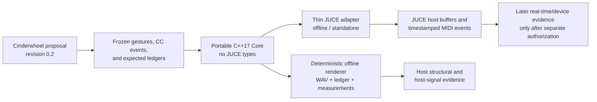
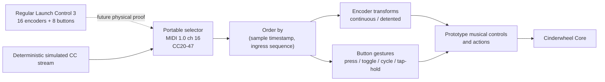

# Cinderwheel source-to-JUCE trial

Status: source, host-structural, host-signal, pinned-JUCE build, and physical
MIDI-input source path verified on 2026-08-20; real-time, connected-device, and
listening evidence is still deferred.

This directory is an isolated prototype for testing whether one approved sonic
proposal can become a portable DSP core, deterministic offline render, and thin
JUCE standalone host without prematurely changing Schuss's production graph,
provider, controller-runtime, or device layers.

## Frozen source contract

| Field | Bound value |
|---|---|
| Proposal | `research/proposals/cinderwheel.md` |
| Proposal status at approval | `proposed` |
| Proposal revision | `0.2` |
| Git blob | `c075035b9c844eedd29f7f172e557cc985ad6d48` |
| File SHA-256 | `d9b3a50cde3c25a4db6324bd8d20f1a65eaefcbd1ac8e9e7a42adc80713b5e84` |
| Approval | User prompt on 2026-08-20: use the research document as a trial for taking an idea from specification to a working JUCE instrument |
| Trial identity | Prototype only; no Schuss stable ID is allocated |

The approval authorizes this implementation trial. It does not silently
authorize publication, dependency installation, physical controller mutation,
audio/MIDI device access, firmware or SD-card work, staging, committing, or
pushing. A follow-up user report on 2026-08-20 that the running app could not be
controlled by MIDI authorizes the bounded read-only MIDI-input path described
below; it does not authorize writing a controller Custom Mode or claiming a
successful device session. Any result is compared with the exact proposal bytes
above rather than with an ambient latest revision.

## Goal and why it exists

Build the smallest host-testable instrument that can answer the proposal's
central musical question: can an explicit integer-ratio Undertow and a bounded,
lossy rotor-routed four-voice Wake create a learnable secondary rhythm or
melody from a four-stage Tide Pit-shaped cycle?

The trial exists to expose the missing steps between a well-researched sonic
proposal and executable JUCE-hosted DSP. It tests the proposed counterpoint
mechanism and the development workflow. It does not yet prove that the result
preserves the audible identity of the complete live Tide Pit.

## Trial boundary

### In scope

- A JUCE-independent C++17 `Core` with fixed, preallocated processing state.
- Float processing at exactly 48,000 Hz, zero audio inputs, stereo output, and a
  maximum block size of 512 frames.
- Deterministic processing across block partitions of 64, 128, and 512 frames
  for one identical timestamped control stream.
- A four-stage test stimulus, Undertow follower, four Wake resonators, bounded
  energy/rotor scheduler, Ember, Bloom, Reset, Panic, output safety, and
  diagnostics sufficient to test the proposal's central mechanism.
- An original, deterministic body/grain-like context surrogate. No Mutable
  Instruments or VCV source is copied into this trial.
- One explicit simulated map for the regular Novation Launch Control 3:
  MIDI channel 16, absolute encoder CC20-35, and momentary button CC40-47.
- A deterministic offline renderer and retained controller fixture, ledgers,
  measurements, and local reference renders. The v0 render gesture is compiled
  into the renderer; extracting it as a machine-readable input fixture remains
  a recorded workflow gap.
- A thin JUCE adapter that sends timestamped MIDI/control events into the same
  portable Core and copies the Core's stereo output into host buffers. The
  adapter may provide an offline target and a standalone target; it is not the
  DSP or semantic authority.
- Focused source, mapping, state, event-bound, block-partition, numeric-safety,
  and host-adapter tests.
- Recording verified commands, results, deviations, and proof gaps after the
  implementation freezes.

### Out of scope

- Editing the live Tide Pit or importing its Mutable-derived implementation.
- Task 033 or 034 records, schemas, manifests, stable IDs, provider manifests,
  production runtime factories, shared Schuss operations, or governance state.
- Treating JUCE classes, the prototype controller map, or generated C++ as an
  authoritative Schuss graph or instrument.
- `juce_dsp`, VST3/AU/CLAP packaging, plugin hosting, GUI design, presets,
  signing, notarization, distribution, or release licensing.
- Novation Components export/write, automatic physical Launch Control 3
  validation, MIDI output/feedback, OLED/LED feedback, automatic reconnect, or
  device firmware changes. The standalone may enumerate and open one explicitly
  selected MIDI input after the follow-up authorization.
- Ksoloti/Gills/H7 lowering, compile/link, upload, flash, hardware execution,
  embedded optimization, or fixed-point conversion.
- General real-time fitness, connected-device success, broad listener approval,
  or audible Tide Pit-lineage claims.

## Architecture

The portable Core owns all musical state and sample processing. JUCE is a host
adapter only, matching ADR 0016's dependency direction.



### Prototype controller flow

This is an executable prototype mapping, not a canonical Task 034 performance
graph. That is deliberate: the trial must first prove the controller semantics
and musical mechanism without allocating production identities or inventing a
performance-graph executor that Schuss does not yet have.



The exact v0 surface graph is deliberately one page and matches the regular
16-encoder/eight-button model:

| Physical row | 1 | 2 | 3 | 4 | 5 | 6 | 7 | 8 |
|---|---|---|---|---|---|---|---|---|
| Top encoders | Wave 1 / CC20 | Wave 2 / CC21 | Wave 3 / CC22 | Wave 4 / CC23 | Rate / CC24 | Memory / CC25 | Body / CC26 | Position / CC27 |
| Bottom encoders | FX-A / CC28 | FX-B / CC29 | Root / CC30 | Undertow / CC31 | Pulse Divide / CC32 | Wake / CC33 | Structure / CC34 | Ember / CC35 |
| Buttons | Source tap, Scale hold / CC40 | Mutate / CC41 | Lock / CC42 | Freeze / CC43 | FX Mode / CC44 | Target / CC45 | Bloom / CC46 | Reset tap, Panic hold / CC47 |

All messages are MIDI 1.0 channel 16. Encoders are absolute seven-bit CCs;
buttons are momentary `127` press / `0` release. The JSON fixture separates
these physical selectors from semantic transforms, defaults, timing, and
application actions so a later production graph can reuse the decisions
without treating this prototype artifact as canonical.

A later production integration must express the portable selectors through a
performance configuration, reusable performance-control graph, public
instrument facets, and instrument-to-DSP mappings. It may not replace this
prototype's evidence with a direct controller-to-DSP shortcut.

## Inputs

- The exact proposal revision and fingerprints above.
- Schuss workspace instructions, project context, ADR 0016, ADR 0017, and the
  Task 032/034 execution and evidence boundaries.
- The proposal's 48 kHz, maximum-512-frame, event-cap, Reset/Panic, and output
  safety requirements.
- `fixtures/launch-control-3-test-map-v0.json` as the prototype-only controller
  contract.
- The pinned private-development JUCE 8.0.15 source lock already held by
  Schuss. The portable Core must not expose or require JUCE types.

## Deliverables

1. Portable Core headers and implementation.
2. Prototype controller-map fixture and adapter with mapping validation.
3. Deterministic C++ tests for processing, state, events, safety, and block
   partitioning.
4. Offline renderer plus an exact compiled gesture schedule, event ledgers,
   measurements, and local reference renders.
5. Thin JUCE offline/standalone adapter and host-boundary tests.
6. CMake targets that build the Core/tests without JUCE and build the JUCE
   adapter only when explicitly enabled.
7. `TRIAL_GAPS.md` as the actionable spec-to-JUCE workflow gap register.
8. A verified result record containing exact commands, outputs, deviations,
   artifact fingerprints, and remaining evidence gaps.

## Acceptance criteria

The trial is accepted only when all applicable checks below have verified
results. An intentionally deferred row is not a pass at another evidence level.

1. The proposal path, revision, Git blob, and file SHA-256 match the frozen
   source contract before building.
2. The portable Core builds and its focused tests run without JUCE, Mutable,
   VCV, physical devices, network I/O during processing, or package installs.
3. The simulated mapping accepts only MIDI channel 16 CC20-47 as assigned,
   rejects/counts other input, and applies equal-timestamp events in ingress
   sequence order.
4. Encoder quantization and button press/release, toggle, cycle, 600 ms hold,
   1,200 ms hold, Bloom, Reset, and Panic behavior match the frozen fixture.
5. Repeated runs produce an identical event ledger. Processing the same event
   stream in 64-, 128-, and 512-frame partitions produces an identical ledger
   and audio agreement within the frozen numeric tolerance.
6. Undertow Off is structurally excluded and active divisors configure the
   expected resonator coefficient. An acoustic output-pitch estimator remains
   required before claiming audible ratio tolerance. `Ember=0` emits exactly
   zero afterstrikes.
7. The scheduler emits no same-transition transferred event, no more than one
   afterstrike per node, no more than two afterstrikes per transition, and no
   more than 72 total Wake strikes per second at the maximum cycle rate.
8. Reset restores the declared musical/ledger reference state. Panic applies
   the declared 10 ms ramp, reaches the frozen silence threshold, and leaves no
   pending Wake energy.
9. Applicable parameter extremes and hostile states produce no propagated
   NaN/Inf, unbounded work, dynamic processing-path allocation, runaway output,
   or peak above the -1 dBFS ceiling; diagnostics record contained failures.
10. The offline renderer produces the frozen gesture set, ledger, measurements,
    and reference audio using the same Core exercised by tests.
11. The JUCE adapter builds against the exact pinned source, contains no musical
    DSP authority, and produces the same offline Core result for the same event
    stream. A standalone executable may be built without opening a physical
    audio or MIDI device during automated validation.
12. Focused and adjacent validation appropriate to this isolated subtree pass;
    the complete diff is reviewed; no out-of-scope file or user work changes.
13. Results are reported separately as source, host structural, host signal,
    JUCE build, real-time, physical-controller/device, and listening evidence.

The first slice accepts the Undertow/Wake mechanism at source and host-signal
levels. It cannot accept the proposal's musical-usefulness or
recognizable-Tide-Pit hypotheses until a fixed comparator, exact-source
comparison, and listening session occur.

## Decisions this trial may make

- Original DSP equations, coefficients, defaults, finite capacities, fixture
  formats, and tolerances needed to realize the bounded proposal experiment.
- The internal C++ API, preallocated state layout, deterministic event-ordering
  implementation, and private prototype file layout.
- A minimal WAV/ledger/measurement representation and stable artifact naming.
- A thin JUCE adapter layout using only the already pinned private-development
  dependency boundary.
- Narrow corrections needed to make the prototype fixture, Core, tests, and
  documentation agree, provided the proposal's musical identity and bounds do
  not change silently.

## Decisions this trial must not make

- New Schuss stable identities, canonical records, graph schemas, provider ABI,
  runtime factory semantics, production performance-control execution, target
  eligibility, or evidence promotion outside this prototype.
- A JUCE graph or class as semantic authority, implicit Q27/float equivalence,
  or Ksoloti compatibility.
- Physical endpoint identity, controller firmware/configuration, MIDI feedback,
  device behavior, real-time headroom, or audible quality without corresponding
  evidence.
- Cultural naming, borrowed repertoire, samples, patterns, visual identity, or
  authenticity claims.
- Publication, packaging, distribution terms, staging, commit, push, upload,
  flash, or other external mutation.

## Verified build and test commands

The JUCE-free Core and mapping checks require only the checked-out prototype,
CMake, a C++17 compiler, and Python:

```sh
cmake -S research/prototypes/cinderwheel -B build/cinderwheel-core-trial \
  -DCMAKE_BUILD_TYPE=Release \
  -DCINDERWHEEL_ENABLE_JUCE=OFF
cmake --build build/cinderwheel-core-trial --parallel
ctest --test-dir build/cinderwheel-core-trial --output-on-failure
```

The exact authenticated JUCE route is explicit and opt-in. It fetches only the
archive for commit `91ad83ae34a81e0833b1a2b0866f54846370ae53` and verifies
SHA-256 `04f8d5055382582c757be9da069ea98338005f98248facd9c2804435ac853e70`:

```sh
cmake -S research/prototypes/cinderwheel -B build/cinderwheel-juce-trial \
  -DCMAKE_BUILD_TYPE=Release \
  -DCINDERWHEEL_ENABLE_JUCE=ON \
  -DCINDERWHEEL_ALLOW_JUCE_FETCH=ON
cmake --build build/cinderwheel-juce-trial --parallel
ctest --test-dir build/cinderwheel-juce-trial --output-on-failure
```

An already extracted tree can instead be supplied through
`CINDERWHEEL_JUCE_SOURCE_DIR`, but that path verifies only JUCE's `8.0.15`
version macros; the operator remains responsible for authenticating its commit
or bytes. A single retained render can be reproduced with:

```sh
build/cinderwheel-juce-trial/cinderwheel-render \
  --output-dir build/cinderwheel-final-v0-128 \
  --block 128
```

The registered render-matrix test runs blocks 64, 128, and 512 plus a fresh
128-frame repeat. No command here authorizes launching the app, opening a
physical audio/MIDI endpoint, or writing a Launch Control Custom Mode.

## Standalone MIDI-input test

The standalone now lists available MIDI inputs and automatically selects the
best non-DAW endpoint whose name contains `Launch Control 3`. If no matching
endpoint is present, choose it from the `MIDI input` menu and use `Refresh MIDI`
after connecting or reconnecting the controller. The application opens MIDI
input only: it sends no MIDI feedback and writes no controller configuration.

The status line reports the selected endpoint, total received messages, and the
last received CC as channel/controller/value. This separates three failures:

1. no endpoint listed means macOS/JUCE cannot currently discover the device;
2. an endpoint with a fixed receive count means no MIDI is reaching the app;
3. a changing count with values other than channel 16 CC20-35/40-47 means the
   controller Custom Mode does not match the frozen prototype map.

Valid channel-16 encoder CC20-35 input also updates the corresponding on-screen
slider at approximately 30 Hz. UI notifications are suppressed for this path,
so reflection cannot enqueue a duplicate CC event. This display is raw physical
input reflection, not authoritative Core-state feedback: while FX-A or FX-B
soft pickup is armed, the displayed controller value may move before the active
effect parameter accepts the crossing.

Launch the rebuilt app only when opening the default audio output and selected
MIDI input is intended:

```sh
open build/cinderwheel-juce-trial/cinderwheel-instrument_artefacts/Release/Cinderwheel.app
```

This source/build path does not establish connected-device evidence. That
requires recording the actual endpoint, controller/firmware/Custom Mode,
received messages, gestures, reconnect result, and listening observation.

## Evidence ladder

| Level | Required artifact or observation | Current state |
|---|---|---|
| Research/catalog | Cited proposal and source ledger | Present in frozen proposal revision 0.2 |
| Design proposal | Revision 0.2 plus user approval | Approved for this bounded trial |
| Source implementation | Portable Core, mapping, renderer, JUCE adapter | **PASS for isolated prototype** |
| Host structural | Focused tests, bounds, reset, partition invariance | **PASS**; Core 2/2 and pinned-JUCE tree 4/4 CTests |
| Host signal | Repeated renders and objective measurements | **PASS for bounded safety/determinism claims**; musical and acoustic-pitch acceptance remain open |
| JUCE/native build | Exact pinned JUCE adapter compiles and offline parity holds | **PASS**; app bundle built but not launched |
| Real-time | Declared device/load budget and callback measurement | Deferred; not claimed |
| Physical controller/device | Components map, MIDI capture, feedback, reconnect | Deferred; not claimed |
| Listening | Documented author comparison and Tide Pit-lineage judgment | Deferred; not claimed |

## Verified results

The detailed observation, commands, hashes, metrics, and corrections are in
[`RESULTS.md`](RESULTS.md). The focused result is:

- JUCE-free configure/build passed; CTest passed `2/2`.
- The exact pinned-JUCE configure/build passed, including the standalone
  `Cinderwheel.app`; CTest passed `4/4`. The app was not launched.
- The JUCE MIDI adapter is fixed-capacity at 128 events per block and its test
  proved malformed/drop accounting, lifecycle reset, no allocation in the
  exercised adapter/Core path, and bit-exact direct-Core parity.
- ASan/UBSan focused Core tests passed with leak detection disabled because the
  macOS leak-sanitizer path is unsupported in this environment.
- The Schuss `current` validation profile passed `4/4` checks with zero failed
  or incomplete checks.
- Six 40-second, 48 kHz stereo conditions rendered at blocks 64, 128, and 512.
  All 12 WAV/ledger artifacts were byte-identical across block sizes; a fresh
  128-frame process reproduced all 13 outputs exactly. The block-128 manifest
  SHA-256 is
  `5141fe881bb3012fb654d9c52b62d59fcacbbbdad45141596452d7097ee466aa`.
- Final render peaks range from `0.2642559707` to `0.8778860569`; absolute DC
  means remain below `2.15e-6`; `Ember=0` produced zero afterstrikes; and the
  high-Ember Bloom case exercised the event cap once.

These are source, host-structural, host-signal, and build observations. They do
not imply callback timing, lock freedom, controller/device operation, target
fitness, Tide Pit lineage, or audible quality.
